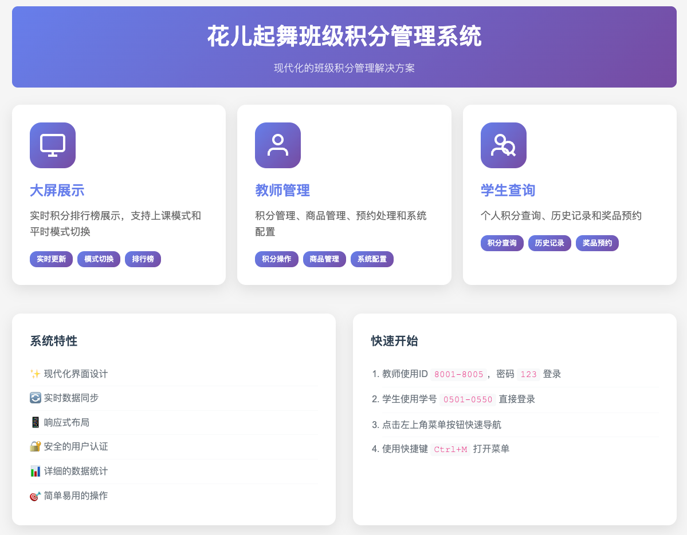
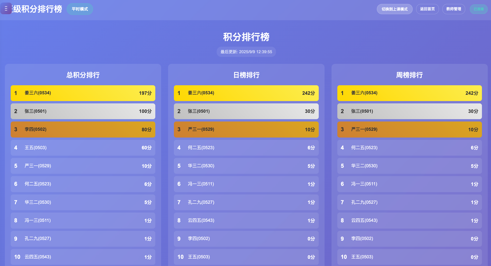
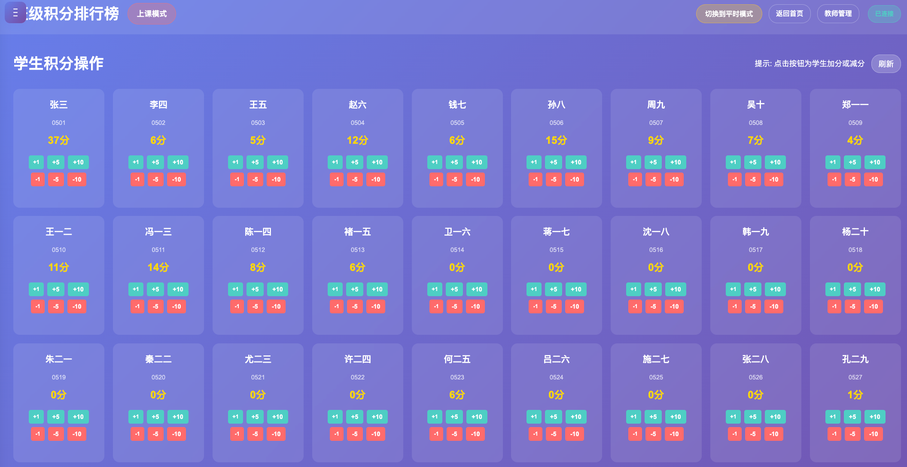
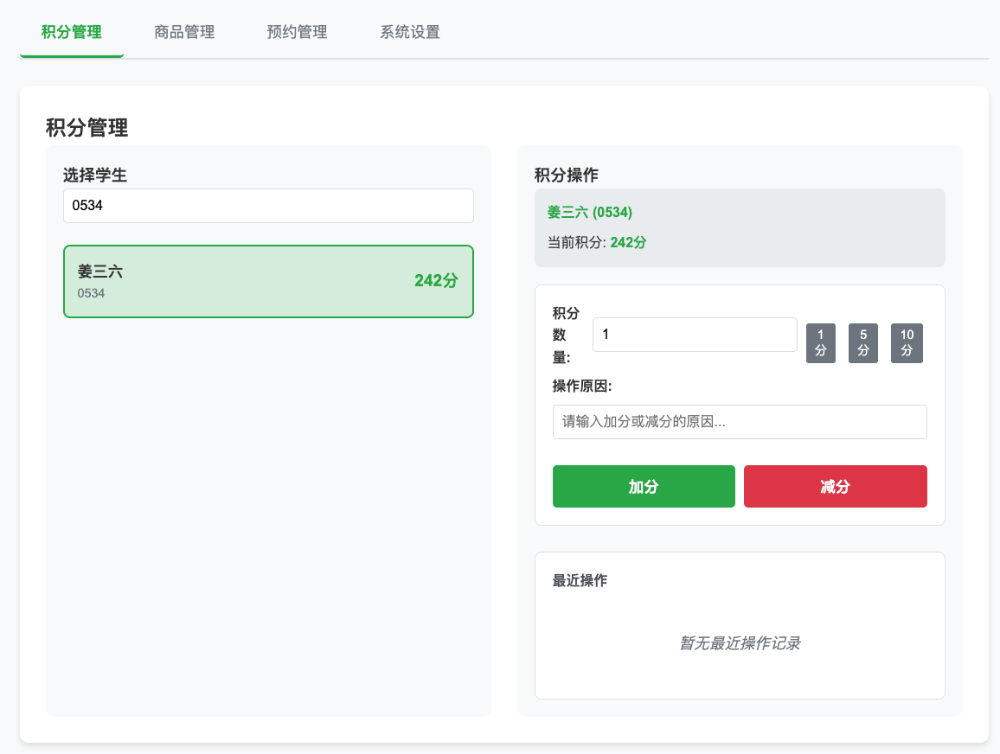
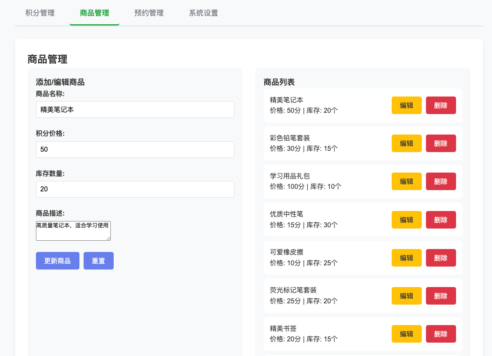
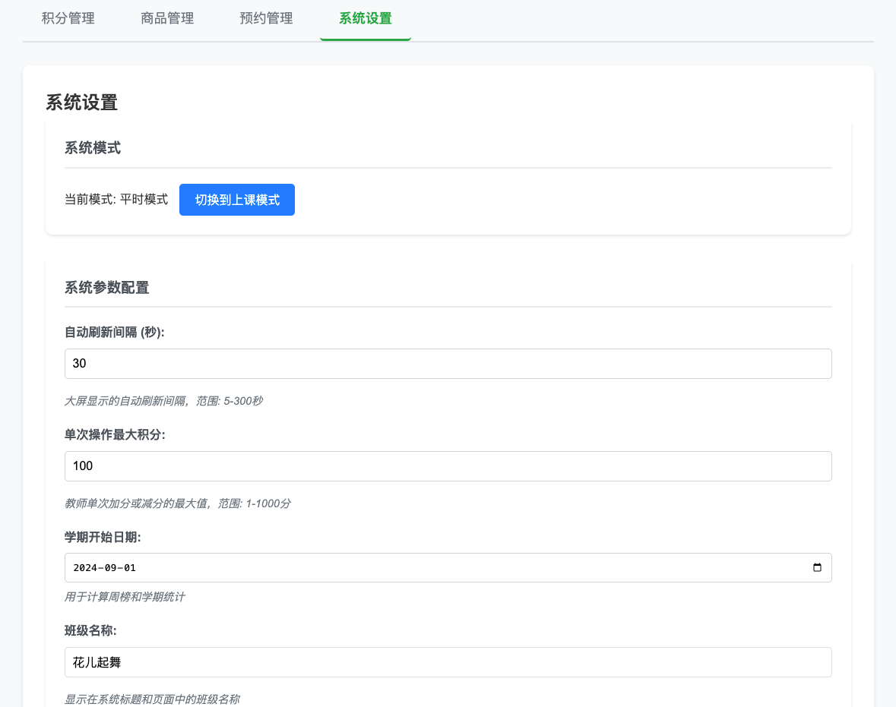
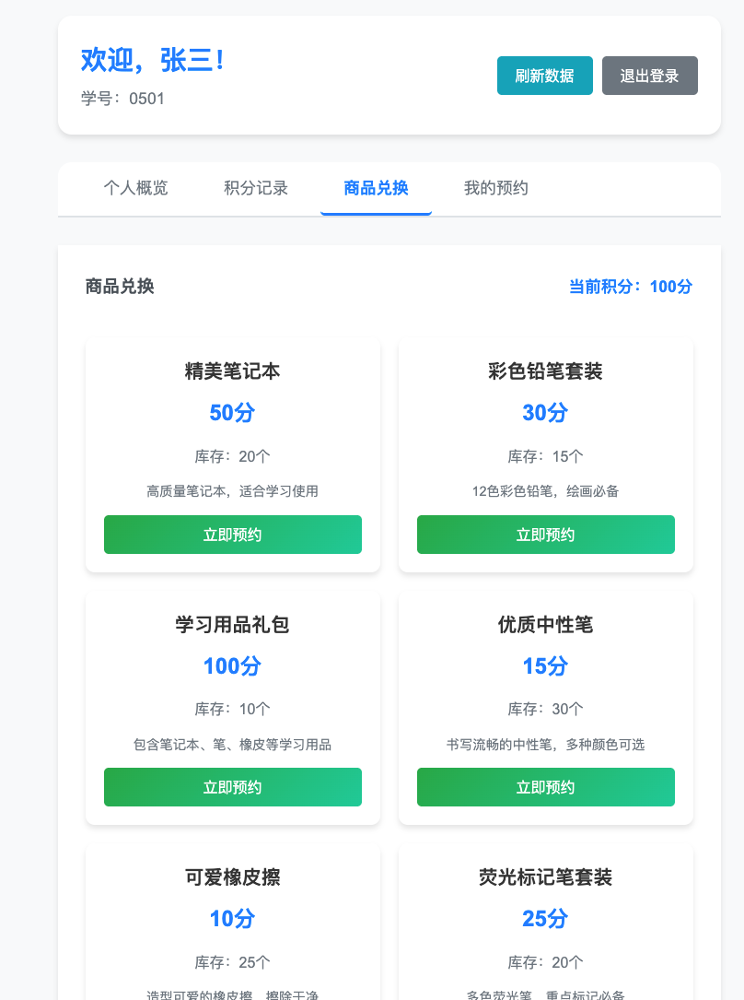
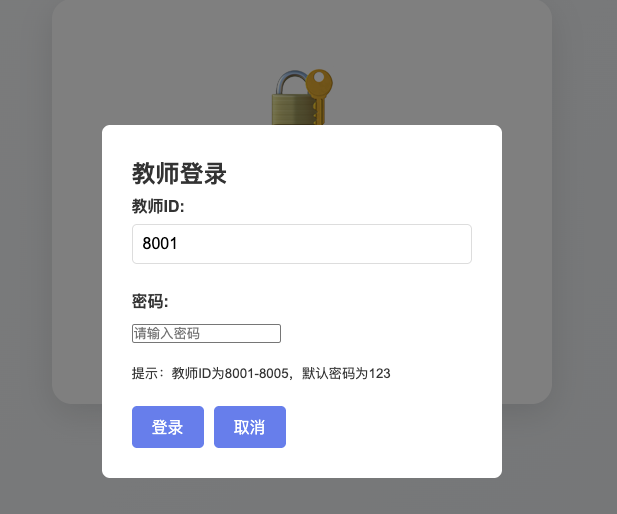
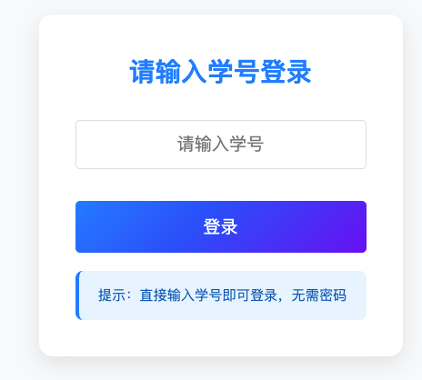
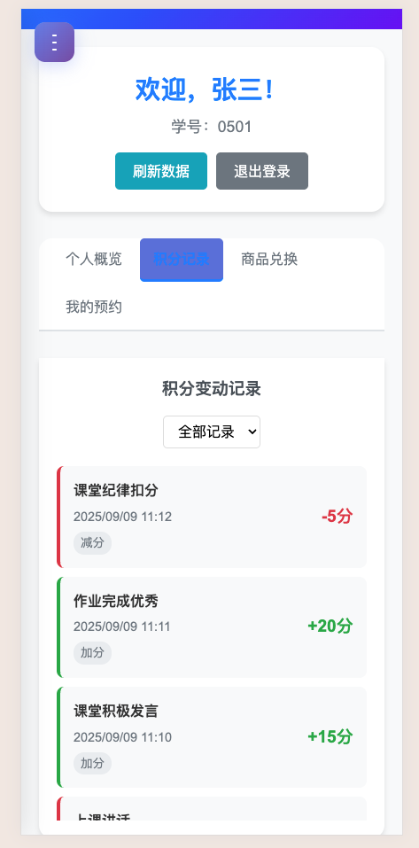

# 班级积分管理系统

一个简化的积分管理工具，专为中学班级设计。系统在教室大屏上显示学生积分排行榜，教师可通过管理界面进行积分操作，学生可查看个人积分并预约奖品。

> **🤖 AI 驱动项目**: 本系统完全由 AI 编程助手设计和开发，展示了 AI 在全栈 Web 开发中的强大能力。从需求分析到代码实现，从测试编写到文档生成，全程 AI 自动化完成。

## 🎯 功能特点

- **🖥️ 大屏展示**: 实时显示学生积分排行榜，支持教室投影
- **👨‍🏫 教师管理**: 简单直观的积分加减操作界面
- **👨‍🎓 学生查询**: 个人积分查看和奖品预约功能
- **💾 数据持久化**: 基于JSON文件的可靠数据存储
- **⚡ 实时更新**: 使用Server-Sent Events实现实时数据推送
- **🔐 权限控制**: 教师和学生分离的权限管理
- **📊 数据统计**: 总积分、日积分、周积分多维度排行
- **🎁 奖品系统**: 完整的商品预约和兑换流程

## 📸 功能截图

### 🏠 系统首页

*系统主页面，提供各功能模块的快速入口*

### 🖥️ 大屏展示 - 平时模式

*教室大屏展示积分排行榜，包含总积分、日榜、周榜三个维度*

### 🖥️ 大屏展示 - 上课模式

*上课模式下的学生积分操作界面，学生按学号排序，方便教师快速操作*

### 👨‍🏫 教师管理 - 积分管理

*教师积分管理界面，支持学生搜索、积分加减操作和操作记录查看*

### 👨‍🏫 教师管理 - 商品管理

*商品管理界面，支持添加、编辑、删除奖品商品*

### 👨‍🏫 教师管理 - 预约管理

*预约订单管理，查看和确认学生的商品预约*

### 👨‍🏫 教师管理 - 系统设置

*系统配置界面，包含模式切换、参数配置、数据管理等功能*

### 👨‍🎓 学生查询 - 个人中心

*学生个人中心，显示积分余额、排名和操作记录*

### 👨‍🎓 学生查询 - 商品浏览

*学生商品浏览界面，可以查看商品信息并进行预约*

### 🔐 登录界面



*教师和学生登录界面，支持不同权限的用户认证*

### 📱 移动端适配

*系统支持移动端访问，响应式设计适配各种屏幕尺寸*

> **📝 截图说明**: 如需添加或更新截图，请参考 [screenshots/README.md](screenshots/README.md) 中的详细指南。

## 🛠️ 技术栈

- **后端**: Node.js + Express.js
- **前端**: HTML5 + CSS3 + 原生JavaScript
- **数据存储**: JSON文件系统
- **实时通信**: Server-Sent Events (SSE)
- **认证**: JWT Token
- **测试**: Jest + Supertest

## 🤖 AI 驱动开发

本系统主要由 **AI 编程助手**完成编码工作，展示了现代 AI 技术在软件开发中的强大能力：

### 🎯 AI 开发特色
- **🧠 智能架构设计**: AI 分析需求并设计了完整的系统架构
- **⚡ 快速代码生成**: 从需求到完整系统，AI 在短时间内完成了所有编码工作
- **🔧 自动化测试**: AI 编写了全面的单元测试、集成测试和性能测试
- **📚 完整文档**: 包括 API 文档、部署指南、用户手册等全部由 AI 生成
- **🛠️ 运维脚本**: 部署、监控、备份等运维脚本均由 AI 自动化生成

### 💡 AI 开发优势
- **高效率**: 传统需要数周的开发工作，AI 在数小时内完成
- **高质量**: AI 遵循最佳实践，代码结构清晰，注释完整
- **全栈覆盖**: 从前端界面到后端 API，从数据库设计到部署脚本，全栈开发
- **测试完备**: 自动生成的测试覆盖率高，保证代码质量
- **文档齐全**: 自动生成用户友好的文档和部署指南

### 🚀 技术实现亮点
- **智能需求分析**: AI 理解中文需求并转化为技术实现
- **最佳实践应用**: 自动应用行业最佳实践和设计模式
- **错误处理**: 完善的错误处理和用户体验优化
- **性能优化**: 自动优化数据库查询和前端性能
- **安全考虑**: 内置安全机制和权限控制

> **🎉 这是一个展示 AI 编程能力的完整项目案例，证明了 AI 可以独立完成复杂的全栈 Web 应用开发！**

### 📖 详细了解 AI 开发过程
想了解更多关于 AI 如何开发这个项目的详细信息，请查看：
- **[AI 开发详细说明](docs/AI-DEVELOPMENT.md)** - 完整的 AI 开发流程和技术细节
- **[项目架构文档](docs/ARCHITECTURE.md)** - 系统架构和设计思路
- **[开发日志](docs/DEVELOPMENT-LOG.md)** - AI 开发过程记录

## 🚀 快速开始

### 环境要求

- Node.js 14.0.0 或更高版本
- npm 6.0.0 或更高版本
- 2GB+ 内存，1GB+ 磁盘空间

### 一键启动

```bash
# 下载项目
git clone <repository-url>
cd classroom-points-system

# 一键启动（自动安装依赖并启动服务）
./scripts/start.sh dev

# 验证部署
./scripts/verify-deployment.sh
```

### 手动安装

```bash
# 安装依赖
npm install

# 启动开发服务器
npm start

# 或使用开发模式
npm run dev
```

### 访问系统

- **主页**: http://localhost:3000
- **大屏展示**: http://localhost:3000/display
- **教师管理**: http://localhost:3000/teacher  
- **学生查询**: http://localhost:3000/student

### 默认账户

**教师账户**:
- 8001 / 123 (张老师)
- 8002 / 123 (李老师)  
- 8003 / 123 (王老师)
- 8004 / 123 (赵老师)
- 8005 / 123 (钱老师)
- admin / admin123 (管理员，向后兼容)

**学生账户**: 使用学生学号登录（无需密码）
- 学号范围: 0501-0550
- 班级名称: 花儿起舞

### 系统配置

**班级信息**:
- 默认班级名称: "花儿起舞"
- 系统作者: "茗雨"
- 版权信息: "© 2025 花儿起舞班级积分管理系统 | 作者：茗雨"

**配置管理**:
- 班级名称可在教师管理 → 系统设置中修改
- 作者和版权信息支持自定义设置
- 配置更改后立即在所有页面生效

## 📁 项目结构

```
classroom-points-system/
├── 📁 public/                 # 前端静态文件
│   ├── 📁 display/           # 大屏展示界面
│   ├── 📁 teacher/           # 教师管理界面
│   ├── 📁 student/           # 学生查询界面
│   ├── 📁 css/               # 共享样式文件
│   └── 📁 js/                # 共享JavaScript文件
├── 📁 api/                   # 后端API路由
├── 📁 services/              # 业务逻辑服务
├── 📁 middleware/            # 中间件
├── 📁 utils/                 # 工具函数
├── 📁 data/                  # JSON数据文件
├── 📁 tests/                 # 测试文件
├── 📁 scripts/               # 部署和运维脚本
├── 📁 docs/                  # 文档
│   ├── 📄 AI-DEVELOPMENT.md  # AI 开发详细说明
│   ├── 📄 ARCHITECTURE.md    # 系统架构文档
│   └── 📄 API.md            # API 接口文档
├── 📁 config/                # 配置文件
└── 📄 server.js             # 主服务器文件
```

## 🔧 部署指南

### 生产环境快速部署

```bash
# 一键生产部署
./scripts/start.sh prod

# 验证部署状态
./scripts/verify-deployment.sh

# 查看服务状态
./scripts/health-check.sh --verbose
```

### 使用 PM2 部署

```bash
# 安装 PM2
npm install -g pm2

# 启动服务
pm2 start ecosystem.config.js --env production

# 查看状态
pm2 status
pm2 logs classroom-points-system
```

### 使用 systemd 部署

```bash
# 复制服务文件
sudo cp config/systemd/classroom-points.service /etc/systemd/system/

# 启动服务
sudo systemctl enable classroom-points
sudo systemctl start classroom-points

# 查看状态
sudo systemctl status classroom-points
```

### Docker 部署

```bash
# 构建镜像
docker build -t classroom-points-system .

# 运行容器
docker-compose up -d

# 查看状态
docker-compose ps
```

## 📊 监控和维护

### 系统监控

```bash
# 持续监控（带告警）
./scripts/monitor.sh --interval 60 --log-file logs/monitor.log

# 健康检查
./scripts/health-check.sh --verbose

# 性能检查
curl http://localhost:3000/api/health
```

### 数据备份

```bash
# 手动备份
npm run backup

# 通过API备份
curl -X POST http://localhost:3000/api/backup/create \
  -H "Authorization: Bearer YOUR_TEACHER_TOKEN"

# 查看备份列表
ls -la backups/
```

### 日志管理

```bash
# 查看应用日志
tail -f logs/app.log

# 查看PM2日志
pm2 logs classroom-points-system

# 查看系统日志
sudo journalctl -u classroom-points -f
```

## 📸 截图生成

### 快速生成截图

```bash
# 一键启动系统并显示截图指南
./scripts/generate-screenshots.sh

# 仅显示截图指南（不启动服务器）
./scripts/generate-screenshots.sh --no-start

# 查看帮助信息
./scripts/generate-screenshots.sh --help
```

### 手动截图步骤

1. **启动系统**: `npm start`
2. **准备数据**: 添加学生积分、创建商品、生成预约
3. **按序截图**: 参考 [screenshots/README.md](screenshots/README.md)
4. **验证效果**: 检查所有截图文件完整性

### 截图验证

```bash
# 检查截图完整性
./scripts/check-screenshots.sh

# 生成详细报告
./scripts/check-screenshots.sh --report

# 查看修复建议
./scripts/check-screenshots.sh --fix
```

## 🧪 测试

### 运行测试

```bash
# 运行所有测试
npm test

# 运行集成测试
./scripts/run-tests.sh integration

# 运行性能测试
./scripts/run-tests.sh performance

# 运行单元测试
./scripts/run-tests.sh unit
```

### 测试覆盖

- ✅ 单元测试：服务层和工具函数
- ✅ 集成测试：完整用户流程
- ✅ API测试：所有接口端点
- ✅ 并发测试：数据一致性
- ✅ 性能测试：响应时间和负载

## 📚 API文档

### 认证接口
- `POST /api/auth/teacher-login` - 教师登录
- `POST /api/auth/student-login` - 学生登录

### 积分管理
- `POST /api/points/add` - 加分（教师权限）
- `POST /api/points/subtract` - 减分（教师权限）
- `GET /api/points/rankings` - 获取排行榜
- `GET /api/points/history/:studentId` - 获取积分历史

### 学生管理
- `GET /api/students` - 获取学生列表（教师权限）
- `POST /api/students` - 创建学生（教师权限）
- `GET /api/students/:id` - 获取学生信息
- `PUT /api/students/:id` - 更新学生信息（教师权限）
- `DELETE /api/students/:id` - 删除学生（教师权限）

### 商品管理
- `GET /api/products` - 获取商品列表
- `POST /api/products` - 创建商品（教师权限）
- `PUT /api/products/:id` - 更新商品（教师权限）
- `DELETE /api/products/:id` - 删除商品（教师权限）

### 订单管理
- `POST /api/orders/reserve` - 预约商品（学生权限）
- `GET /api/orders/pending` - 获取待确认订单（教师权限）
- `POST /api/orders/:id/confirm` - 确认订单（教师权限）
- `POST /api/orders/:id/cancel` - 取消订单

### 系统管理
- `GET /api/config/mode` - 获取系统模式
- `POST /api/config/mode` - 设置系统模式（教师权限）
- `GET /api/health` - 健康检查
- `POST /api/backup/create` - 创建备份（教师权限）
- `GET /api/backup/list` - 获取备份列表（教师权限）

## ⚙️ 配置说明

### 环境配置

- `config/production.json` - 生产环境配置
- `config/development.json` - 开发环境配置

### 重要配置项

```json
{
  "server": {
    "port": 3000,
    "host": "0.0.0.0"
  },
  "security": {
    "jwtSecret": "请在生产环境中修改此密钥",
    "jwtExpiresIn": "24h"
  },
  "logging": {
    "level": "info",
    "file": {
      "enabled": true,
      "path": "logs/app.log"
    }
  }
}
```

## 🔒 安全配置

### 必须修改的配置

1. **JWT 密钥**（生产环境必须修改）
2. **CORS 配置**（限制访问域名）
3. **教师密码**（修改默认密码）

### 安全建议

- ✅ 使用 HTTPS
- ✅ 配置防火墙
- ✅ 定期更新依赖
- ✅ 监控访问日志
- ✅ 定期备份数据

## 🚨 故障排除

### 常见问题

1. **端口被占用**
   ```bash
   ./scripts/stop.sh  # 停止服务
   lsof -i :3000      # 查看端口占用
   ```

2. **数据文件损坏**
   ```bash
   # 从备份恢复
   cd backups
   unzip backup-YYYY-MM-DD-HH-mm-ss.zip
   cp -r backup-data/* ../data/
   ./scripts/restart.sh prod
   ```

3. **服务无法启动**
   ```bash
   ./scripts/health-check.sh  # 诊断问题
   tail -f logs/app.log       # 查看错误日志
   ```

### 获取帮助

```bash
# 查看脚本帮助
./scripts/start.sh --help
./scripts/health-check.sh --help
./scripts/monitor.sh --help
```

## 📈 性能指标

### 基准性能

- **API响应时间**: < 1秒
- **并发用户**: 支持50+并发
- **内存使用**: < 500MB
- **磁盘空间**: < 100MB（不含日志）

### 监控指标

- ✅ 服务可用性 > 99%
- ✅ 响应时间 < 1000ms
- ✅ 错误率 < 1%
- ✅ 内存使用率 < 80%

## 🔄 更新升级

### 应用更新

```bash
# 停止服务
./scripts/stop.sh

# 备份当前版本
cp -r . ../classroom-points-system-backup

# 更新代码和依赖
# （解压新版本文件）
npm install --production

# 重启服务
./scripts/start.sh prod
```

## 🤝 贡献指南

### 传统开发贡献
1. Fork 项目
2. 创建功能分支 (`git checkout -b feature/AmazingFeature`)
3. 运行测试 (`npm test`)
4. 提交更改 (`git commit -m 'Add some AmazingFeature'`)
5. 推送到分支 (`git push origin feature/AmazingFeature`)
6. 打开 Pull Request

### AI 辅助开发
本项目展示了 AI 编程的完整流程，如果你想了解或参与 AI 驱动的开发：

- **🔍 学习 AI 开发模式**: 研究项目结构和代码组织方式
- **🤖 使用 AI 工具**: 尝试使用 AI 编程助手进行功能扩展
- **📊 分析 AI 代码质量**: 评估 AI 生成代码的质量和最佳实践应用
- **🚀 AI 功能增强**: 使用 AI 添加新功能或优化现有功能

> **💡 提示**: 这个项目是 AI 编程能力的完整展示，代码质量、架构设计、测试覆盖率都达到了生产级别标准。

## 🤖 AI 开发声明

本项目是 **AI 编程技术**的完整展示案例：

### 开发过程
- **需求分析**: AI 理解中文需求并进行系统分析
- **架构设计**: AI 设计了完整的前后端分离架构
- **代码实现**: AI 编写了所有前端、后端和数据库代码
- **测试编写**: AI 创建了全面的测试套件
- **文档生成**: AI 生成了完整的技术文档和用户指南
- **部署脚本**: AI 编写了自动化部署和运维脚本

### 技术水平
- ✅ **生产级质量**: 代码质量达到生产环境标准
- ✅ **最佳实践**: 自动应用行业最佳实践和设计模式
- ✅ **完整功能**: 实现了完整的业务功能和用户体验
- ✅ **测试覆盖**: 高覆盖率的自动化测试
- ✅ **文档齐全**: 详细的技术文档和使用说明

### 意义价值
这个项目证明了 **AI 已经具备独立完成复杂软件项目的能力**，为软件开发行业的未来发展提供了重要参考。

## 📄 许可证

本项目采用 MIT 许可证 - 查看 [LICENSE](LICENSE) 文件了解详情。

## 📞 联系支持

如有问题或建议：

- 📧 提交 Issue
- 💬 发送邮件至 [mingyu0704@outlook.com]
- 📖 查看文档：`docs/` 目录

## 📝 更新日志

### v1.0.0 (2025-09-09) - AI 驱动首发版本
- 🤖 **AI 全栈开发**: 完全由 AI 编程助手完成的全栈 Web 应用
- ✨ **核心功能**: 基础积分管理功能
- 🖥️ **用户界面**: 大屏展示和管理界面
- 👨‍🎓 **学生功能**: 学生查询和商品预约功能
- 🛠️ **运维工具**: 完整的部署和监控脚本
- 🧪 **测试覆盖**: 全面的单元测试、集成测试和性能测试
- 📚 **文档完整**: AI 生成的完整文档和使用指南
- 🔧 **最佳实践**: 遵循行业最佳实践的代码结构和安全机制

> **🎯 里程碑**: 这是一个完全由 AI 独立开发的生产级 Web 应用，展示了 AI 编程技术的成熟度和实用性。

---

**🎉 部署完成！系统已准备就绪，开始使用班级积分管理系统吧！**