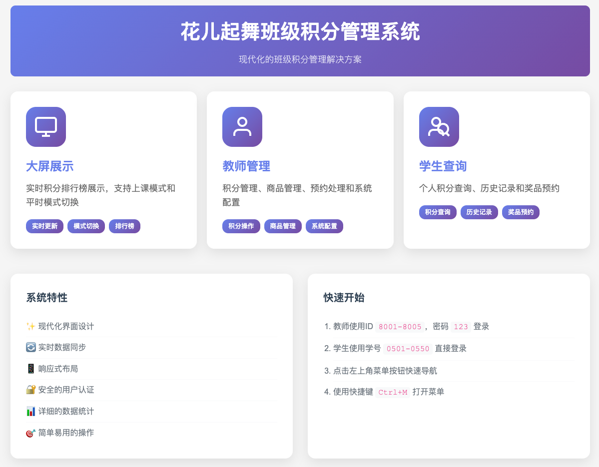
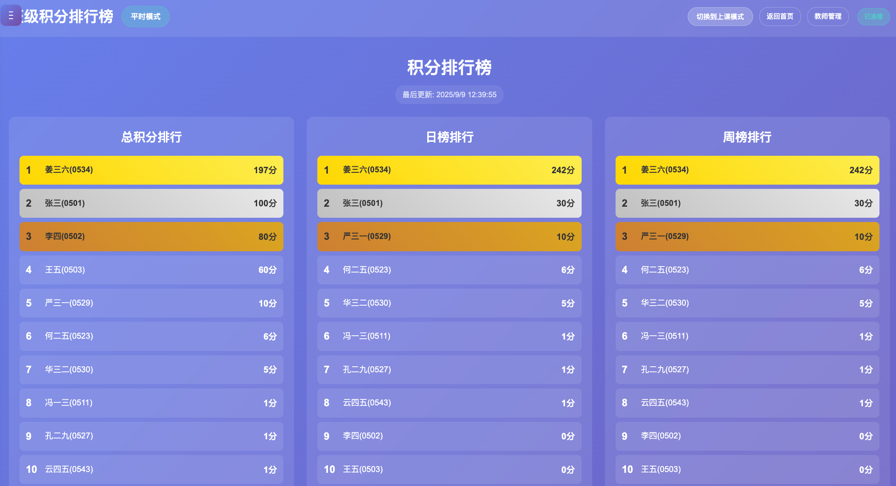
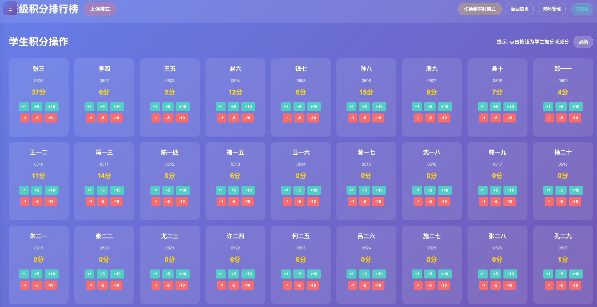
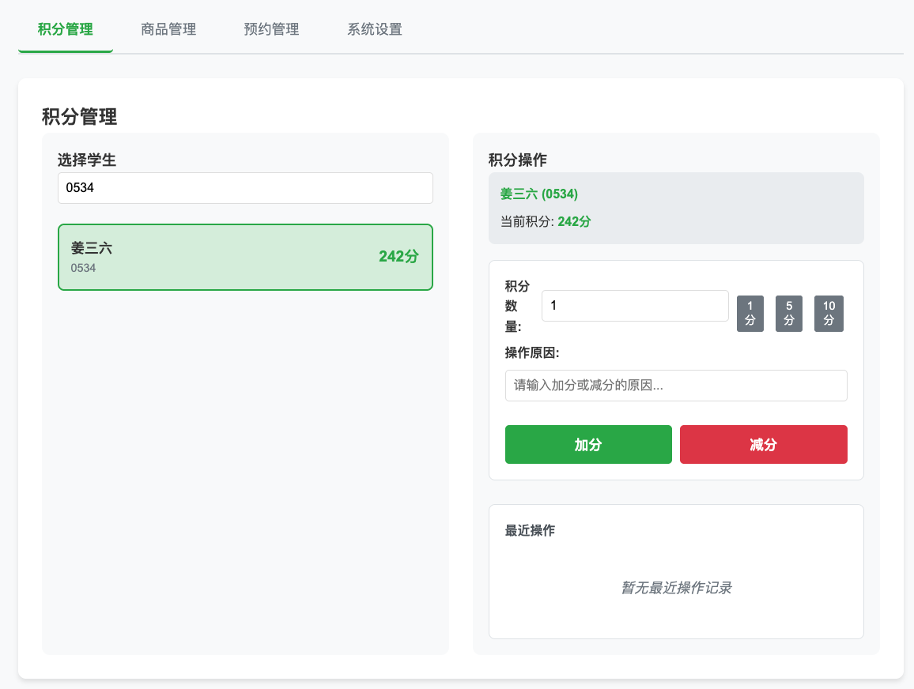
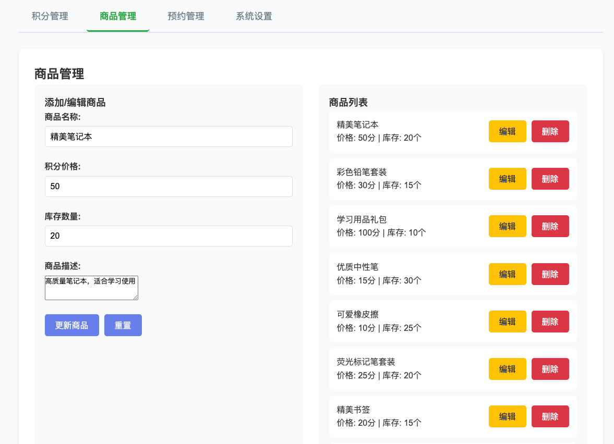
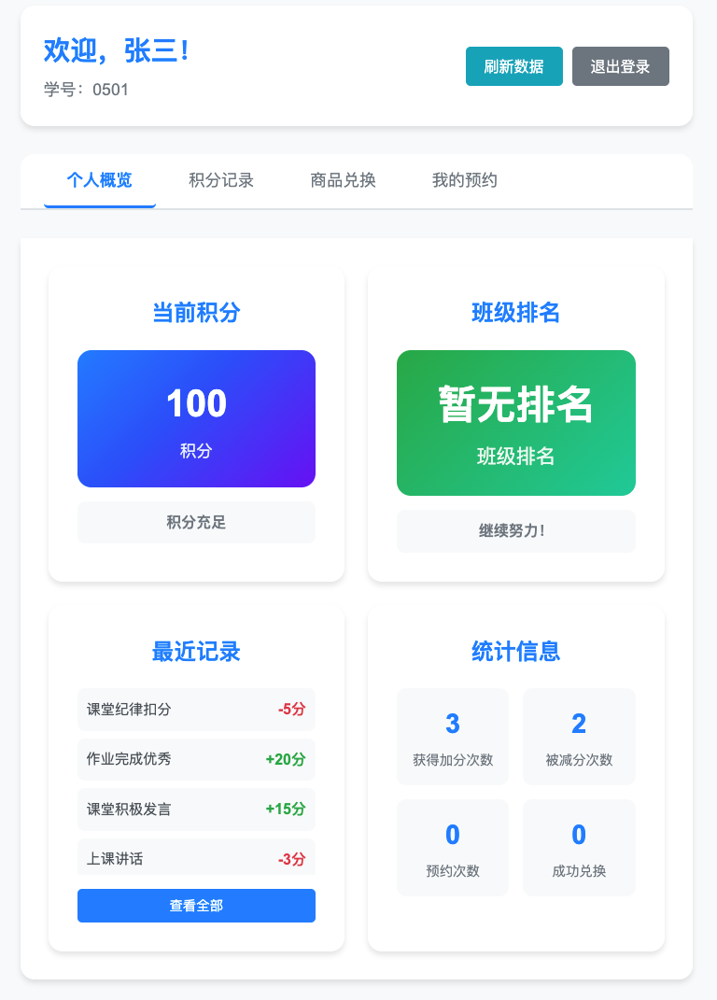
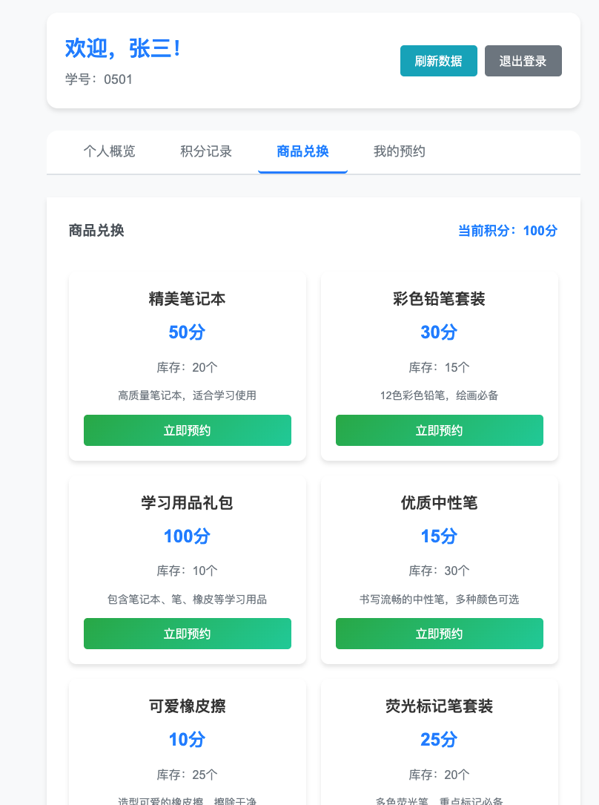
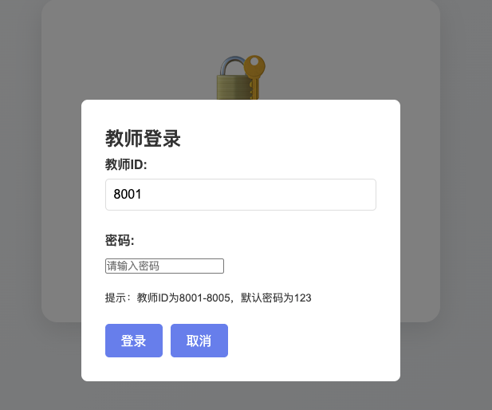
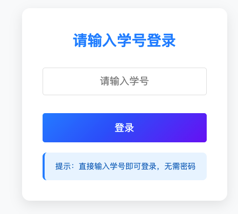
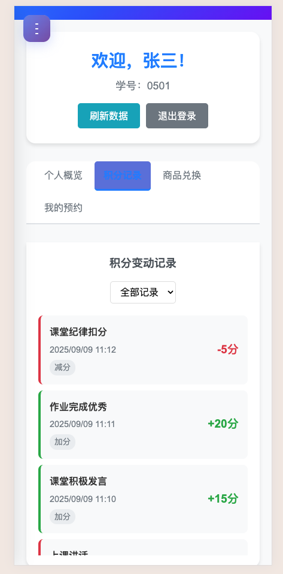

# 班级积分管理系统

一个简化的积分管理工具，专为中学班级设计。系统在教室大屏上显示学生积分排行榜，教师可通过管理界面进行积分操作，学生可查看个人积分并预约奖品。

> **🤖 AI 驱动项目**: 本系统完全由 AI 编程助手设计和开发，展示了 AI 在全栈 Web 开发中的强大能力。从需求分析到代码实现，从测试编写到文档生成，全程 AI 自动化完成。

## 🎯 功能特点

- **🖥️ 大屏展示**: 实时显示学生积分排行榜，支持教室平时/上课双模式投影
- **👨‍🏫 教师管理**: 简单直观的积分加减操作界面，支持多维度的数据追踪
- **👨‍🎓 学生查询**: 个人积分查看和奖品在线预约功能
- **💾 数据库引擎**: 基于高性能 SQLite 3 引擎的数据存储，保障并发读写安全
- **⚡ 实时更新**: 使用 Server-Sent Events 实现大屏与前端数据的无刷新推送
- **🔐 权限控制**: 教师、学生、系统管理员（Admin）、班主任（导演角色）四级权限分离
- **📊 数据统计**: 总积分、日榜、周榜多维度排行，且按学期严格隔离
- **🎁 奖品系统**: 完整的商品预留库存、预约和兑换审核流程

## 📸 系统界面展示

### 🏠 系统首页

*系统主页面，提供各功能模块的快速入口*

### 🖥️ 大屏展示模式
<table>
<tr>
<td width="50%">

**平时模式**

*教室大屏展示积分排行榜，包含总积分、日榜、周榜三个维度*

</td>
<td width="50%">

**上课模式**

*上课模式下的学生积分操作界面，学生按学号排序，方便教师快速操作*

</td>
</tr>
</table>

### 👨‍🏫 教师管理界面
<table>
<tr>
<td width="50%">

**积分管理**

*教师积分管理界面，支持学生搜索、积分加减操作和操作记录查看*

</td>
<td width="50%">

**商品管理**

*商品管理界面，支持添加、编辑、删除奖品商品*

</td>
</tr>
</table>

### 👨‍🎓 学生查询界面
<table>
<tr>
<td width="50%">

**个人中心**

*学生个人中心，显示积分余额、排名和操作记录*

</td>
<td width="50%">

**商品浏览**

*学生商品浏览界面，可以查看商品信息并进行预约*

</td>
</tr>
</table>

### 🔐 登录界面 & 📱 移动端适配
<table>
<tr>
<td width="50%">

**教师登录**

*教师登录界面，支持教师账号密码认证*

**学生登录**

*学生登录界面，使用学号快速登录*

</td>
<td width="50%">

**移动端界面**

*系统支持移动端访问，响应式设计适配各种屏幕尺寸*

</td>
</tr>
</table>

> **📝 截图说明**: 系统支持移动端访问，响应式设计适配各种屏幕尺寸。更多截图详情请查看 **[完整截图展示](docs/SCREENSHOTS.md)**

## 🤖 AI 驱动开发亮点

本系统完全由 **AI 编程助手**开发，展示了现代AI技术在软件开发中的强大能力：

### 🎯 AI 开发特色
- **🧠 智能架构设计**: AI 分析需求并设计了完整的系统架构
- **⚡ 快速代码生成**: 从需求到完整系统，AI 在短时间内完成了所有编码工作
- **🔧 自动化测试**: AI 编写了全面的单元测试、集成测试和性能测试
- **📚 完整文档**: 包括 API 文档、部署指南、用户手册等全部由 AI 生成
- **🛠️ 运维脚本**: 部署、监控、备份等运维脚本均由 AI 自动化生成

> **🎉 这是一个展示 AI 编程能力的完整项目案例，证明了 AI 可以独立完成复杂的全栈 Web 应用开发！**

详细了解请查看 **[AI 开发详细说明](docs/AI-DEVELOPMENT.md)**

## 🛠️ 技术栈

- **后端**: Node.js + Express.js
- **前端**: HTML5 + CSS3 + 原生JavaScript (零构建依赖)
- **数据库引擎**: SQLite 3 (node-sqlite3)
- **实时通信**: Server-Sent Events (SSE)
- **认证安全**: JWT Token (带有强保护与过期策略)
- **测试框架**: Jest + Supertest

## 🔄 版本更新说明

本系统持续在快速迭代并修复生产环境中遇到的各种细节问题。有关最新版本的功能扩展、修复清单与底层结构修改细节，请参阅：

👉 **[查看完整更新日志 (CHANGELOG) ](CHANGELOG.md)**

- **1.2.0**：主要新增数据一致性智能修复、真实服务器级系统资源告警隔离、修复基于大小写引发的群晖NAS模块加载崩溃、修复“最近操作”列表缺失。
- **1.1.0**：增加“学期积分完全隔离系统”、超管降级防删体系、修正部分导致系统交互跳动的 UI 层 Bug。

## 升级与交叉部署指南 (含 NAS 部署)

**⚠️ 架构跨平台部署注意（Mac -> Linux NAS 环境）**：
因为本项目依赖于含有 C++ 原生扩展的 `sqlite3` 数据库引擎驱动，所以 **不能** 直接把 Mac 本地构建好的 `node_modules` 文件夹复制到 Linux/NAS 服务器上运行。

如果您需要在群晖（Synology NAS）或其他 Linux 机器上升级和部署本系统：

```bash
# 1. 备份现有的业务数据数据库
cp data/database.sqlite data/database.sqlite.bak

# 2. 如果您之前直接复制了 Mac 或者 Windows 的依赖内容，请彻底删除它！
rm -rf node_modules

# 3. 让当前的操作系统（Linux）重新编译并下载与自身内核架构相匹配的依赖
npm install

# 4. 重启系统（如使用 Systemd）
sudo systemctl restart cls-mvp.service
```

## 🚀 快速开始


### 一键启动

```bash
# 下载项目
git clone <repository-url>
cd classroom-points-system

# 一键启动（自动安装依赖并启动服务）
./scripts/start.sh dev

# 验证部署
./scripts/verify-deployment.sh
```

### 访问系统

- **主页**: http://localhost:3000
- **大屏展示**: http://localhost:3000/display
- **教师管理**: http://localhost:3000/teacher  
- **学生查询**: http://localhost:3000/student

### 默认账户

### 默认账户

**高级管理账户 (内建隐藏)**:
- admin (密码需在配置文件/环境变量中指定或在初始化时设定，初始默认通常为预设管理密码)

**教师账户**:
- 8001 / 123 (张老师)
- 8002 / 123 (阚老师)

**学生账户**: 使用学生学号登录（无需密码）
- 学号范围: 0501-0550
- 班级名称: 花儿起舞

## 📁 项目结构

```
classroom-points-system/
├── 📁 public/                 # 前端静态文件
│   ├── 📁 display/           # 大屏展示界面
│   ├── 📁 teacher/           # 教师管理界面
│   ├── 📁 student/           # 学生查询界面
│   ├── 📁 css/               # 共享样式文件
│   └── 📁 js/                # 共享JavaScript文件
├── 📁 api/                   # 后端API路由
├── 📁 services/              # 业务逻辑服务
├── 📁 middleware/            # 中间件
├── 📁 utils/                 # 工具函数
├── 📁 data/                  # JSON数据文件
├── 📁 tests/                 # 测试文件
├── 📁 scripts/               # 部署和运维脚本
├── 📁 docs/                  # 文档
├── 📁 config/                # 配置文件
└── 📄 server.js             # 主服务器文件
```

## 🤝 贡献指南

### AI 辅助开发
本项目展示了 AI 编程的完整流程，如果你想了解或参与 AI 驱动的开发：

- **🔍 学习 AI 开发模式**: 研究项目结构和代码组织方式
- **🤖 使用 AI 工具**: 尝试使用 AI 编程助手进行功能扩展
- **📊 分析 AI 代码质量**: 评估 AI 生成代码的质量和最佳实践应用
- **🚀 AI 功能增强**: 使用 AI 添加新功能或优化现有功能

## 📄 许可证

本项目采用 MIT 许可证 - 查看 [LICENSE](LICENSE) 文件了解详情。

## 📞 联系支持

- 📧 提交 Issue
- 💬 发送邮件至 [mingyu0704@outlook.com]
- 📖 查看文档：`docs/` 目录

---

**🎉 部署完成！系统已准备就绪，开始使用班级积分管理系统吧！**