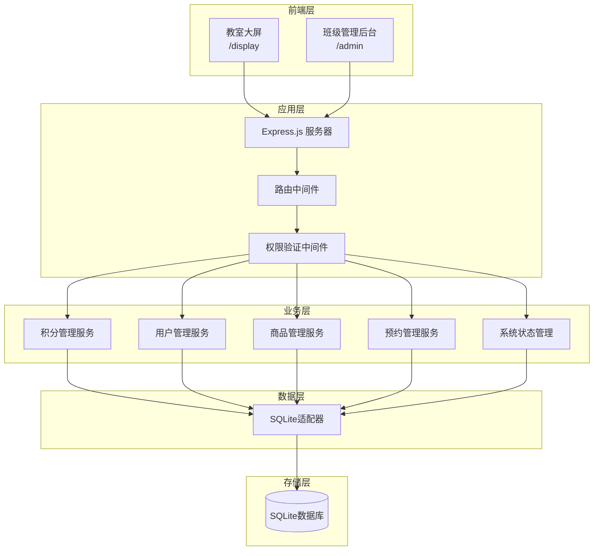
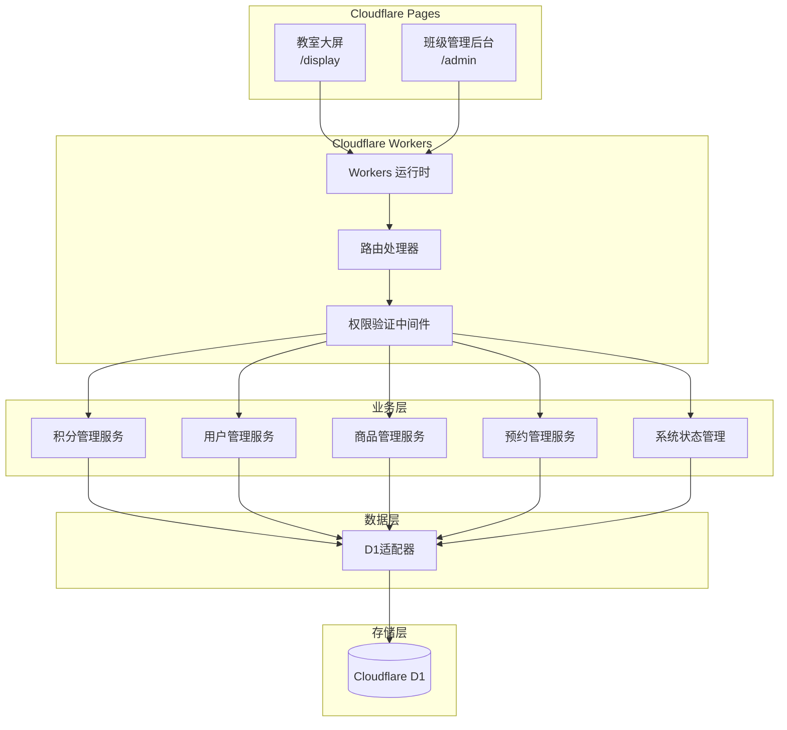

# 设计文档 - 班级积分系统 V1

## 概述

班级积分系统V1是一个单班级的简洁积分管理工具，专注于核心功能的快速实现。系统支持两种部署方式：本地部署（Node.js + SQLite）和云端部署（Cloudflare Pages/Workers + D1），满足不同场景的需求。

### 核心特性
- 单班级部署，简化架构
- 两个独立入口：教室大屏、班级管理后台
- 双部署支持：本地SQLite / 云端Cloudflare D1
- 实时数据同步和自动状态管理
- 中文界面，适合中学课堂使用

### 部署方案对比

| 特性 | 本地部署 | Cloudflare部署 |
|------|----------|----------------|
| 后端技术 | Node.js + Express.js | Cloudflare Workers |
| 前端技术 | 静态文件服务 | Cloudflare Pages |
| 数据存储 | SQLite | Cloudflare D1 |
| 部署复杂度 | 简单（单机部署） | 中等（需要配置CF） |
| 运维成本 | 需要服务器维护 | 无服务器，自动扩展 |
| 访问速度 | 局域网快速 | 全球CDN加速 |
| 成本 | 服务器成本 | 免费额度内基本免费 |

## 系统架构

### 本地部署架构图



### Cloudflare部署架构图



### 路由设计

```
/display                    # 教室大屏入口
/admin                      # 班级管理后台入口
/api/points/*              # 积分管理API
/api/students/*            # 学生管理API
/api/products/*            # 商品管理API
/api/orders/*              # 预约管理API
/api/system/*              # 系统状态API
/api/auth/*                # 认证API
```

## 核心组件设计

### 1. 系统状态管理器

负责管理大屏的模式切换和状态维护：

```javascript
// 系统状态接口
interface SystemState {
  mode: 'normal' | 'class'      // 模式：平时模式/上课模式
  currentTeacher?: string       // 当前教师
  sessionStartTime?: Date       // 会话开始时间
  autoSwitchTimer?: NodeJS.Timeout  // 自动切换定时器
}

// 状态管理器接口
interface StateManager {
  getCurrentState(): SystemState                    // 获取当前状态
  switchToClassMode(teacherId: string): Promise<boolean>  // 切换到上课模式
  switchToNormalMode(): Promise<boolean>            // 切换到平时模式
  startAutoSwitchTimer(): void                      // 启动自动切换定时器
  clearAutoSwitchTimer(): void                      // 清除自动切换定时器
}
```

### 2. 权限管理系统

```javascript
// 用户权限接口
interface UserPermission {
  userId: string       // 用户ID
  role: 'admin' | 'teacher' | 'student'  // 角色：班主任/任课老师/学生
  permissions: string[]  // 权限列表
}

// 权限验证器接口
interface PermissionValidator {
  validateTeacherAccess(teacherId: string): Promise<boolean>  // 验证教师访问权限
  validateAdminAccess(userId: string): Promise<boolean>       // 验证班主任访问权限
  validateStudentQuery(studentNumber: string): Promise<boolean>  // 验证学生查询权限
}
```

### 3. 数据访问层

#### 统一数据访问接口

```javascript
// 数据库适配器接口（支持SQLite和D1）
interface DatabaseAdapter {
  // 数据库初始化
  initializeDatabase(): Promise<void>               // 初始化数据库
  createTables(): Promise<void>                     // 创建表结构
  
  // 学生管理
  getStudents(): Promise<Student[]>                 // 获取学生列表
  createStudent(student: Student): Promise<Student> // 创建学生
  updateStudent(studentId: string, updates: Partial<Student>): Promise<Student>  // 更新学生信息
  deleteStudent(studentId: string): Promise<boolean>  // 删除学生
  
  // 积分管理
  getPointRecords(filters?: PointFilter): Promise<PointRecord[]>  // 获取积分记录
  createPointRecord(record: PointRecord): Promise<PointRecord>    // 创建积分记录
  calculatePointBalance(studentId: string): Promise<number>       // 计算积分余额
  clearAllPoints(): Promise<boolean>                              // 清零所有积分
  
  // 商品管理
  getProducts(): Promise<Product[]>                 // 获取商品列表
  createProduct(product: Product): Promise<Product> // 创建商品
  updateProduct(productId: string, updates: Partial<Product>): Promise<Product>  // 更新商品信息
  
  // 预约管理
  getOrders(filters?: OrderFilter): Promise<Order[]>  // 获取预约订单
  createOrder(order: Order): Promise<Order>           // 创建预约订单
  updateOrderStatus(orderId: string, status: OrderStatus): Promise<Order>  // 更新订单状态
  
  // 奖惩项管理
  getRewardPenaltyItems(): Promise<RewardPenaltyItem[]>  // 获取奖惩项列表
  createRewardPenaltyItem(item: RewardPenaltyItem): Promise<RewardPenaltyItem>  // 创建奖惩项
  updateRewardPenaltyItem(itemId: string, updates: Partial<RewardPenaltyItem>): Promise<RewardPenaltyItem>  // 更新奖惩项
}

// SQLite适配器实现
class SQLiteAdapter implements DatabaseAdapter {
  private db: Database
  
  constructor(dbPath: string) {
    this.db = new Database(dbPath)
  }
  
  // 实现所有接口方法...
}

// Cloudflare D1适配器实现
class D1Adapter implements DatabaseAdapter {
  private db: D1Database
  
  constructor(db: D1Database) {
    this.db = db
  }
  
  // 实现所有接口方法...
}

// 适配器工厂
class DatabaseAdapterFactory {
  static create(type: 'sqlite' | 'd1', config: any): DatabaseAdapter {
    switch (type) {
      case 'sqlite':
        return new SQLiteAdapter(config.dbPath)
      case 'd1':
        return new D1Adapter(config.db)
      default:
        throw new Error(`Unsupported database type: ${type}`)
    }
  }
}
```
```

## 数据模型设计

### 核心数据模型

```javascript
// 用户信息
interface User {
  id: string
  username: string                // 用户名
  name: string                    // 姓名
  role: 'admin' | 'teacher' | 'student'  // 角色：班主任/任课老师/学生
  studentNumber?: string          // 学号（学生专用）
  isActive: boolean              // 是否激活
  createdAt: Date                // 创建时间
}

// 学生信息（继承用户）
interface Student extends User {
  studentNumber: string           // 学号
  currentBalance: number          // 当前积分余额
  totalEarned: number            // 累计获得积分
  totalSpent: number             // 累计消费积分
}

// 积分记录
interface PointRecord {
  id: string
  studentId: string               // 学生ID
  teacherId: string               // 教师ID
  amount: number                  // 积分变化（正数加分，负数减分）
  reason: string                  // 操作原因
  type: 'manual' | 'reward' | 'penalty' | 'purchase'  // 类型：手动/奖励/惩罚/消费
  createdAt: Date                 // 创建时间
}

// 常用奖惩项
interface RewardPenaltyItem {
  id: string
  name: string                    // 奖惩项名称
  points: number                  // 积分数（正数奖励，负数惩罚）
  type: 'reward' | 'penalty'      // 类型：奖励/惩罚
  isActive: boolean              // 是否启用
  sortOrder: number              // 排序
}

// 商品信息
interface Product {
  id: string
  name: string                    // 商品名称
  description?: string            // 商品描述
  price: number                   // 积分价格
  stock: number                   // 库存数量
  isActive: boolean              // 是否上架
  createdAt: Date                // 创建时间
}

// 预约订单
interface Order {
  id: string
  studentId: string               // 学生ID
  productId: string               // 商品ID
  quantity: number                // 数量
  totalPrice: number              // 总价格
  status: 'pending' | 'confirmed' | 'cancelled' | 'completed'  // 状态：待确认/已确认/已取消/已完成
  createdAt: Date                 // 创建时间
  confirmedAt?: Date              // 确认时间
  completedAt?: Date              // 完成时间
}
```

### 数据库表设计（SQLite/D1通用）

```sql
-- 用户表
CREATE TABLE users (
  id TEXT PRIMARY KEY,
  username TEXT NOT NULL UNIQUE,
  name TEXT NOT NULL,
  role TEXT NOT NULL CHECK (role IN ('admin', 'teacher', 'student')),
  student_number TEXT UNIQUE,
  is_active BOOLEAN DEFAULT 1,
  created_at DATETIME DEFAULT CURRENT_TIMESTAMP
);

-- 积分记录表
CREATE TABLE point_records (
  id TEXT PRIMARY KEY,
  student_id TEXT NOT NULL,
  teacher_id TEXT NOT NULL,
  amount INTEGER NOT NULL,
  reason TEXT NOT NULL,
  type TEXT NOT NULL CHECK (type IN ('manual', 'reward', 'penalty', 'purchase')),
  created_at DATETIME DEFAULT CURRENT_TIMESTAMP,
  FOREIGN KEY (student_id) REFERENCES users(id),
  FOREIGN KEY (teacher_id) REFERENCES users(id)
);

-- 常用奖惩项表
CREATE TABLE reward_penalty_items (
  id TEXT PRIMARY KEY,
  name TEXT NOT NULL,
  points INTEGER NOT NULL,
  type TEXT NOT NULL CHECK (type IN ('reward', 'penalty')),
  is_active BOOLEAN DEFAULT 1,
  sort_order INTEGER DEFAULT 0
);

-- 商品表
CREATE TABLE products (
  id TEXT PRIMARY KEY,
  name TEXT NOT NULL,
  description TEXT,
  price INTEGER NOT NULL,
  stock INTEGER DEFAULT 0,
  is_active BOOLEAN DEFAULT 1,
  created_at DATETIME DEFAULT CURRENT_TIMESTAMP
);

-- 订单表
CREATE TABLE orders (
  id TEXT PRIMARY KEY,
  student_id TEXT NOT NULL,
  product_id TEXT NOT NULL,
  quantity INTEGER NOT NULL,
  total_price INTEGER NOT NULL,
  status TEXT DEFAULT 'pending' CHECK (status IN ('pending', 'confirmed', 'cancelled', 'completed')),
  created_at DATETIME DEFAULT CURRENT_TIMESTAMP,
  confirmed_at DATETIME,
  completed_at DATETIME,
  FOREIGN KEY (student_id) REFERENCES users(id),
  FOREIGN KEY (product_id) REFERENCES products(id)
);

-- 系统状态表
CREATE TABLE system_state (
  id INTEGER PRIMARY KEY CHECK (id = 1),
  mode TEXT DEFAULT 'normal' CHECK (mode IN ('normal', 'class')),
  current_teacher TEXT,
  session_start_time DATETIME,
  updated_at DATETIME DEFAULT CURRENT_TIMESTAMP
);
```

### 部署配置

#### 本地部署配置

```javascript
// config/local.js
module.exports = {
  deployment: 'local',
  server: {
    port: 3000,
    host: '0.0.0.0'
  },
  database: {
    type: 'sqlite',
    path: './data/classroom.db'
  },
  features: {
    autoBackup: true,
    backupInterval: '0 2 * * *' // 每天凌晨2点备份
  }
}
```

#### Cloudflare部署配置

```javascript
// wrangler.toml
name = "classroom-points-system"
main = "src/worker.js"
compatibility_date = "2024-01-01"

[[d1_databases]]
binding = "DB"
database_name = "classroom-points"
database_id = "your-d1-database-id"

[vars]
DEPLOYMENT = "cloudflare"
```

```javascript
// config/cloudflare.js
export default {
  deployment: 'cloudflare',
  database: {
    type: 'd1',
    binding: 'DB'
  },
  features: {
    autoBackup: false, // D1自动备份
    globalCDN: true
  }
}
```

## 接口设计

### 1. 积分管理API

```javascript
// GET /api/points/rankings - 获取积分排行榜
interface RankingsResponse {
  total: Student[]      // 总积分排行
  daily: Student[]      // 日积分排行
  weekly: Student[]     // 周积分排行
}

// POST /api/points/add - 添加积分
interface AddPointsRequest {
  studentId: string
  teacherId: string
  amount: number
  reason: string
  type: 'manual' | 'reward' | 'penalty'
}

// GET /api/points/student/:studentNumber - 获取学生积分信息
interface StudentPointsResponse {
  student: Student
  weeklyRecords: PointRecord[]
  ranking: number
}

// POST /api/points/clear - 清零所有积分
interface ClearPointsRequest {
  adminId: string
  confirmation: boolean
}
```

### 2. 学生管理API

```javascript
// GET /api/students - 获取学生列表
interface StudentsResponse {
  students: Student[]
}

// POST /api/students - 创建学生
interface CreateStudentRequest {
  name: string
  studentNumber: string
}

// PUT /api/students/:id - 更新学生信息
interface UpdateStudentRequest {
  name?: string
  studentNumber?: string
  isActive?: boolean
}
```

### 3. 商品管理API

```javascript
// GET /api/products - 获取商品列表
interface ProductsResponse {
  products: Product[]
}

// POST /api/products - 创建商品
interface CreateProductRequest {
  name: string
  description?: string
  price: number
  stock: number
}

// PUT /api/products/:id - 更新商品信息
interface UpdateProductRequest {
  name?: string
  description?: string
  price?: number
  stock?: number
  isActive?: boolean
}
```

### 4. 预约管理API

```javascript
// GET /api/orders - 获取预约订单列表
interface OrdersResponse {
  orders: Order[]
}

// POST /api/orders - 创建预约订单
interface CreateOrderRequest {
  studentId: string
  productId: string
  quantity: number
}

// PUT /api/orders/:id/status - 更新订单状态
interface UpdateOrderStatusRequest {
  status: 'confirmed' | 'cancelled' | 'completed'
  adminId: string
}
```

### 5. 系统状态API

```javascript
// GET /api/system/state - 获取系统状态
interface SystemStateResponse {
  mode: 'normal' | 'class'
  currentTeacher?: string
  sessionStartTime?: Date
}

// POST /api/system/switch-mode - 切换系统模式
interface SwitchModeRequest {
  mode: 'normal' | 'class'
  teacherId?: string
}
```

## 前端界面设计

### 1. 教室大屏界面 (/display)

#### 平时模式界面
- **顶部**：班级名称和当前时间
- **主体**：积分排行榜（总榜、日榜、周榜切换显示）
- **底部**：学生查询入口和模式切换按钮

#### 上课模式界面
- **顶部**：当前教师和上课时间
- **左侧**：学生列表（按学号排序）
- **右侧**：常用奖惩项按钮
- **底部**：返回平时模式按钮

### 2. 班级管理后台界面 (/admin)

#### 主导航菜单
- 学生管理
- 积分管理
- 商品管理
- 预约管理
- 奖惩项管理
- 系统设置

#### 功能页面
- **学生管理**：学生列表、添加学生、编辑学生信息
- **积分管理**：积分记录查询、手动调整积分、积分清零
- **商品管理**：商品列表、添加商品、编辑商品信息
- **预约管理**：预约订单列表、确认兑换、取消预约
- **奖惩项管理**：奖惩项列表、添加奖惩项、编辑奖惩项

## 错误处理策略

### 1. 数据库错误

#### 本地部署（SQLite）
- SQLite文件不存在：自动创建数据库文件
- 表结构不存在：自动执行建表语句
- 数据操作失败：回滚事务，记录错误日志

#### Cloudflare部署（D1）
- D1数据库未绑定：启动时检查并提示配置错误
- 表结构不存在：自动执行建表语句
- 数据操作失败：利用D1的事务支持进行回滚

### 2. 业务逻辑错误
- 积分不足：允许操作（支持负数积分）
- 库存不足：阻止预约，提示"库存不足"
- 重复操作：防重复提交机制

### 3. 前端错误处理
- 网络连接失败：显示"网络连接失败"提示，支持重试
- 数据加载失败：显示错误信息，提供刷新按钮
- 操作超时：自动重试，超过次数后提示用户

## 测试策略

### 1. 单元测试
- SQLite适配器功能测试
- 业务逻辑服务测试
- 权限验证测试
- 数据模型验证测试

### 2. 集成测试
- API接口测试
- 数据库操作测试
- 前后端集成测试
- 实时通信测试

### 3. 端到端测试
- 用户操作流程测试
- 模式切换测试
- 数据持久化测试
- 错误恢复测试

### 4. 性能测试
- 并发用户访问测试
- 大数据量查询测试
- 内存使用监控
- 响应时间测试
## 部署指南


### 本地部署步骤

1. **环境准备**
   ```bash
   # 安装Node.js 18+
   # 克隆项目代码
   npm install
   ```

2. **数据库初始化**
   ```bash
   # 系统会自动创建SQLite数据库文件
   # 位置：./data/classroom.db
   ```

3. **启动服务**
   ```bash
   npm start
   # 访问 http://localhost:3000/display （教室大屏）
   # 访问 http://localhost:3000/admin （管理后台）
   ```

4. **数据备份**
   ```bash
   # 自动备份到 ./backups/ 目录
   # 手动备份：cp ./data/classroom.db ./backups/backup-$(date +%Y%m%d).db
   ```

### Cloudflare部署步骤

1. **环境准备**
   ```bash
   # 安装Wrangler CLI
   npm install -g wrangler
   wrangler login
   ```

2. **创建D1数据库**
   ```bash
   # 创建D1数据库
   wrangler d1 create classroom-points
   # 记录返回的database_id，更新wrangler.toml
   ```

3. **初始化数据库表**
   ```bash
   # 执行建表语句
   wrangler d1 execute classroom-points --file=./sql/init.sql
   ```

4. **部署Pages和Workers**
   ```bash
   # 构建前端
   npm run build
   
   # 部署Pages
   wrangler pages deploy ./dist
   
   # 部署Workers
   wrangler deploy
   ```

5. **配置自定义域名**
   ```bash
   # 在Cloudflare Dashboard中配置域名
   # 绑定Pages和Workers到同一域名的不同路径
   ```

### 部署方案选择建议

#### 选择本地部署的场景
- 学校内网环境，不需要外网访问
- 对数据安全有严格要求，需要完全本地控制
- 网络环境不稳定，需要离线使用
- 技术团队有服务器运维能力

#### 选择Cloudflare部署的场景
- 需要多地访问，如家校互通
- 希望零运维成本，自动扩展
- 预算有限，希望使用免费服务
- 需要全球CDN加速访问

### 迁移指南

#### 从本地迁移到Cloudflare
1. 导出SQLite数据：`sqlite3 classroom.db .dump > data.sql`
2. 转换SQL语法（如需要）
3. 导入到D1：`wrangler d1 execute classroom-points --file=data.sql`
4. 更新配置文件
5. 部署并测试

#### 从Cloudflare迁移到本地
1. 导出D1数据：`wrangler d1 export classroom-points`
2. 创建本地SQLite数据库
3. 导入数据并测试
4. 更新配置文件
5. 启动本地服务