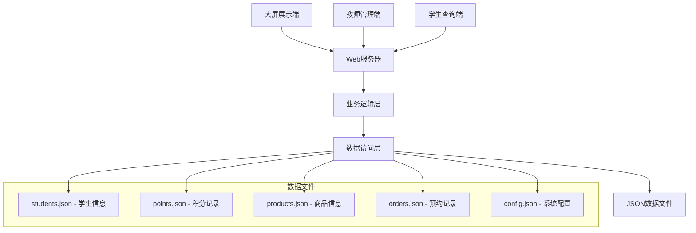

# 设计文档

## 概述

班级积分管理系统采用前后端分离的Web架构，使用轻量级技术栈快速实现MVP版本。系统包含三个主要界面：大屏展示端、教师管理端和学生查询端。数据存储使用本地文件系统，确保部署简单且无需复杂的数据库配置。

## 架构

### 技术栈选择
- **前端**: HTML5 + CSS3 + Vanilla JavaScript (避免复杂框架，快速开发)
- **后端**: Node.js + Express.js (轻量级，易部署)
- **数据存储**: JSON文件 (简单可靠，便于备份和迁移)
- **实时通信**: Server-Sent Events (SSE) 或 WebSocket (用于大屏实时更新)

### 系统架构图



## 组件和接口

### 前端组件

#### 1. 大屏展示组件 (DisplayScreen)
- **平时模式**: 显示积分排行榜、日榜、周榜
- **上课模式**: 显示学生列表和积分操作按钮
- **实时更新**: 通过SSE接收数据更新

#### 2. 教师管理组件 (TeacherPanel)
- **模式切换**: 上课模式/平时模式切换按钮
- **积分操作**: 学生选择、加分减分操作
- **商品管理**: 商品CRUD操作
- **预约管理**: 查看和确认学生预约

#### 3. 学生查询组件 (StudentPanel)
- **登录界面**: 学号输入（无密码）
- **个人中心**: 积分余额、排名、操作记录
- **商品浏览**: 商品列表、预约功能

### 后端API接口

#### 认证相关
```
POST /api/auth/student-login
- 参数: { studentId: string }
- 返回: { success: boolean, student: StudentInfo }

POST /api/auth/teacher-login
- 参数: { teacherId: string, password: string }
- 返回: { success: boolean, token: string }
```

#### 积分管理
```
GET /api/points/rankings
- 返回: { daily: [], weekly: [], total: [] }

POST /api/points/add
- 参数: { studentId: string, points: number, reason: string }
- 返回: { success: boolean, newBalance: number }

POST /api/points/subtract
- 参数: { studentId: string, points: number, reason: string }
- 返回: { success: boolean, newBalance: number }

GET /api/points/history/:studentId
- 返回: { records: PointRecord[] }
```

#### 学生管理
```
GET /api/students
- 返回: { students: StudentInfo[] }

GET /api/students/:id
- 返回: { student: StudentInfo, balance: number, rank: number }
```

#### 商品管理
```
GET /api/products
- 返回: { products: Product[] }

POST /api/products
- 参数: { name: string, price: number, stock: number }
- 返回: { success: boolean, product: Product }

PUT /api/products/:id
- 参数: { name?: string, price?: number, stock?: number }
- 返回: { success: boolean, product: Product }

DELETE /api/products/:id
- 返回: { success: boolean }
```

#### 预约管理
```
POST /api/orders/reserve
- 参数: { studentId: string, productId: string }
- 返回: { success: boolean, order: Order }

GET /api/orders/pending
- 返回: { orders: Order[] }

POST /api/orders/:id/confirm
- 返回: { success: boolean }

POST /api/orders/:id/cancel
- 返回: { success: boolean }
```

#### 系统配置
```
GET /api/config/mode
- 返回: { mode: 'class' | 'normal' }

POST /api/config/mode
- 参数: { mode: 'class' | 'normal' }
- 返回: { success: boolean }

POST /api/config/reset-points
- 返回: { success: boolean }
```

## 数据模型

### 学生信息 (StudentInfo)
```typescript
interface StudentInfo {
  id: string;           // 学号
  name: string;         // 姓名
  class: string;        // 班级
  balance: number;      // 当前积分余额
  createdAt: Date;      // 创建时间
}
```

### 积分记录 (PointRecord)
```typescript
interface PointRecord {
  id: string;           // 记录ID
  studentId: string;    // 学号
  points: number;       // 积分变化（正数为加分，负数为减分）
  reason: string;       // 操作原因
  operatorId: string;   // 操作者ID（教师）
  timestamp: Date;      // 操作时间
  type: 'add' | 'subtract' | 'purchase' | 'refund';
}
```

### 商品信息 (Product)
```typescript
interface Product {
  id: string;           // 商品ID
  name: string;         // 商品名称
  price: number;        // 积分价格
  stock: number;        // 库存数量
  description?: string; // 商品描述
  imageUrl?: string;    // 商品图片
  isActive: boolean;    // 是否启用
  createdAt: Date;      // 创建时间
}
```

### 预约订单 (Order)
```typescript
interface Order {
  id: string;           // 订单ID
  studentId: string;    // 学号
  productId: string;    // 商品ID
  status: 'pending' | 'confirmed' | 'cancelled';
  reservedAt: Date;     // 预约时间
  confirmedAt?: Date;   // 确认时间
  cancelledAt?: Date;   // 取消时间
}
```

### 系统配置 (SystemConfig)
```typescript
interface SystemConfig {
  mode: 'class' | 'normal';        // 系统模式
  autoRefreshInterval: number;     // 自动刷新间隔（秒）
  pointsResetEnabled: boolean;     // 积分清零功能是否启用
  maxPointsPerOperation: number;   // 单次操作最大积分
  semesterStartDate: Date;         // 学期开始日期
}
```

## 错误处理

### 前端错误处理
1. **网络错误**: 显示友好的错误提示，提供重试机制
2. **数据验证错误**: 实时表单验证，高亮错误字段
3. **权限错误**: 重定向到登录页面或显示权限不足提示
4. **服务器错误**: 显示通用错误信息，记录错误日志

### 后端错误处理
1. **参数验证**: 使用中间件验证请求参数，返回详细错误信息
2. **文件操作错误**: 捕获文件读写异常，提供备份恢复机制
3. **业务逻辑错误**: 返回具体的业务错误码和消息
4. **系统异常**: 记录详细错误日志，返回通用错误响应

### 错误码定义
```typescript
enum ErrorCode {
  INVALID_STUDENT_ID = 1001,
  INSUFFICIENT_POINTS = 1002,
  PRODUCT_OUT_OF_STOCK = 1003,
  ORDER_NOT_FOUND = 1004,
  PERMISSION_DENIED = 1005,
  SYSTEM_ERROR = 9999
}
```

## 测试策略

### 单元测试
- **数据访问层**: 测试JSON文件读写操作
- **业务逻辑层**: 测试积分计算、排名算法等核心逻辑
- **API接口**: 测试各个接口的输入输出和错误处理

### 集成测试
- **前后端集成**: 测试API调用和数据传输
- **数据一致性**: 测试并发操作下的数据完整性
- **实时更新**: 测试SSE推送和前端更新机制

### 用户验收测试
- **教师操作流程**: 模拟教师日常积分管理操作
- **学生查询流程**: 验证学生登录和信息查看功能
- **大屏展示效果**: 验证排行榜显示和实时更新
- **商品预约流程**: 测试完整的预约到兑换流程

### 性能测试
- **并发用户**: 测试多个学生同时查询的性能
- **数据量**: 测试大量积分记录下的查询性能
- **实时更新**: 测试频繁积分操作时的更新延迟

### 测试数据准备
```json
{
  "students": [
    {"id": "0501", "name": "张三", "class": "初一(1)班"},
    {"id": "0502", "name": "李四", "class": "初一(1)班"},
    {"id": "0503", "name": "王五", "class": "初一(1)班"},
    {"id": "0504", "name": "赵六", "class": "初一(1)班"},
    {"id": "0505", "name": "钱七", "class": "初一(1)班"}
  ],
  "products": [
    {"name": "笔记本", "price": 50, "stock": 10},
    {"name": "钢笔", "price": 30, "stock": 20},
    {"name": "书签", "price": 10, "stock": 50}
  ]
}
```

## 部署和运维

### 部署方案
1. **单机部署**: 所有组件部署在一台电脑上
2. **端口配置**: Web服务器使用3000端口
3. **静态文件**: 前端文件放在public目录
4. **数据目录**: JSON文件存储在data目录

### 备份策略
1. **自动备份**: 每日自动备份数据文件
2. **手动备份**: 提供一键备份功能
3. **恢复机制**: 支持从备份文件恢复数据

### 监控和日志
1. **操作日志**: 记录所有积分操作和系统配置变更
2. **错误日志**: 记录系统异常和错误信息
3. **访问日志**: 记录用户访问和API调用情况