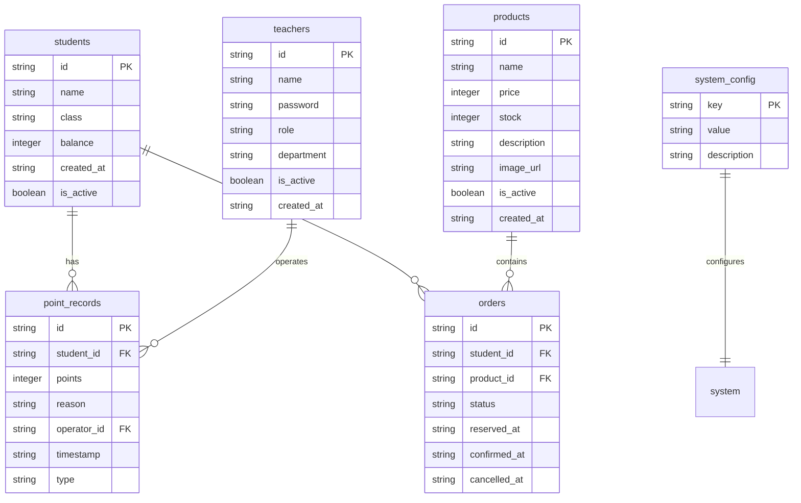

# SQLite数据库迁移技术架构文档

## 1. 当前JSON存储结构分析

### 1.1 数据文件结构
当前系统使用以下JSON文件存储数据：

```
data/
├── students.json      # 学生信息
├── points.json        # 积分记录
├── products.json      # 商品信息
├── orders.json        # 订单信息
├── config.json        # 系统配置
└── backups/           # 备份文件
```

### 1.2 数据模型分析
基于<mcfile name="dataModels.js" path="/Users/dev9/workspace2/SmartStudyLife/classPointSystem/models/dataModels.js"></mcfile>，系统包含以下核心数据模型：

1. **StudentInfo** - 学生信息
   - id, name, class, balance, createdAt

2. **PointRecord** - 积分记录
   - id, studentId, points, reason, operatorId, timestamp, type

3. **Product** - 商品信息
   - id, name, price, stock, description, imageUrl, isActive, createdAt

4. **Order** - 订单信息
   - id, studentId, productId, status, reservedAt, confirmedAt, cancelledAt

5. **SystemConfig** - 系统配置
   - mode, autoRefreshInterval, pointsResetEnabled, maxPointsPerOperation, semesterStartDate

6. **Teacher** - 教师信息
   - id, name, password, role, department, isActive, createdAt

### 1.3 当前数据访问层
基于<mcfile name="dataAccess.js" path="/Users/dev9/workspace2/SmartStudyLife/classPointSystem/utils/dataAccess.js"></mcfile>，当前实现特点：
- 基于文件系统的JSON读写
- 缓存机制（30秒超时）
- 写入队列避免并发冲突
- 自动备份功能
- 性能监控

## 2. SQLite数据库设计方案

### 2.1 数据库架构设计



### 2.2 表结构设计

#### 学生表 (students)
```sql
CREATE TABLE students (
    id TEXT PRIMARY KEY,
    name TEXT NOT NULL,
    class TEXT NOT NULL,
    balance INTEGER DEFAULT 0,
    created_at TEXT DEFAULT CURRENT_TIMESTAMP,
    is_active BOOLEAN DEFAULT 1,
    updated_at TEXT DEFAULT CURRENT_TIMESTAMP
);

CREATE INDEX idx_students_class ON students(class);
CREATE INDEX idx_students_balance ON students(balance DESC);
```

#### 教师表 (teachers)
```sql
CREATE TABLE teachers (
    id TEXT PRIMARY KEY,
    name TEXT NOT NULL,
    password TEXT NOT NULL,
    role TEXT CHECK(role IN ('teacher', 'admin')) DEFAULT 'teacher',
    department TEXT,
    is_active BOOLEAN DEFAULT 1,
    created_at TEXT DEFAULT CURRENT_TIMESTAMP,
    updated_at TEXT DEFAULT CURRENT_TIMESTAMP
);

CREATE INDEX idx_teachers_active ON teachers(is_active);
```

#### 积分记录表 (point_records)
```sql
CREATE TABLE point_records (
    id TEXT PRIMARY KEY,
    student_id TEXT NOT NULL,
    points INTEGER NOT NULL,
    reason TEXT NOT NULL,
    operator_id TEXT NOT NULL,
    timestamp TEXT DEFAULT CURRENT_TIMESTAMP,
    type TEXT CHECK(type IN ('add', 'subtract', 'purchase', 'refund')) DEFAULT 'add',
    FOREIGN KEY (student_id) REFERENCES students(id) ON DELETE CASCADE,
    FOREIGN KEY (operator_id) REFERENCES teachers(id) ON DELETE CASCADE
);

CREATE INDEX idx_point_records_student ON point_records(student_id);
CREATE INDEX idx_point_records_timestamp ON point_records(timestamp DESC);
CREATE INDEX idx_point_records_type ON point_records(type);
```

#### 商品表 (products)
```sql
CREATE TABLE products (
    id TEXT PRIMARY KEY,
    name TEXT NOT NULL,
    price INTEGER NOT NULL CHECK(price >= 0),
    stock INTEGER NOT NULL CHECK(stock >= 0),
    description TEXT,
    image_url TEXT,
    is_active BOOLEAN DEFAULT 1,
    created_at TEXT DEFAULT CURRENT_TIMESTAMP,
    updated_at TEXT DEFAULT CURRENT_TIMESTAMP
);

CREATE INDEX idx_products_active ON products(is_active);
CREATE INDEX idx_products_price ON products(price);
```

#### 订单表 (orders)
```sql
CREATE TABLE orders (
    id TEXT PRIMARY KEY,
    student_id TEXT NOT NULL,
    product_id TEXT NOT NULL,
    status TEXT CHECK(status IN ('pending', 'confirmed', 'cancelled')) DEFAULT 'pending',
    reserved_at TEXT DEFAULT CURRENT_TIMESTAMP,
    confirmed_at TEXT,
    cancelled_at TEXT,
    FOREIGN KEY (student_id) REFERENCES students(id) ON DELETE CASCADE,
    FOREIGN KEY (product_id) REFERENCES products(id) ON DELETE CASCADE
);

CREATE INDEX idx_orders_student ON orders(student_id);
CREATE INDEX idx_orders_status ON orders(status);
CREATE INDEX idx_orders_reserved ON orders(reserved_at DESC);
```

#### 系统配置表 (system_config)
```sql
CREATE TABLE system_config (
    key TEXT PRIMARY KEY,
    value TEXT NOT NULL,
    description TEXT,
    updated_at TEXT DEFAULT CURRENT_TIMESTAMP
);
```

## 3. 数据迁移策略

### 3.1 迁移步骤

#### 步骤1：创建SQLite数据库访问层
创建新的数据库访问模块，保持与现有JSON数据访问层相同的接口：

```javascript
// utils/sqliteDataAccess.js
const sqlite3 = require('sqlite3').verbose;
const path = require('path');

class SQLiteDataAccess {
    constructor(dbPath = 'data/classroom.db') {
        this.db = new sqlite3.Database(dbPath);
        this.initTables();
    }

    async initTables() {
        // 创建所有表结构
        const createTableQueries = [
            // 学生表
            `CREATE TABLE IF NOT EXISTS students (...)`,
            // 教师表
            `CREATE TABLE IF NOT EXISTS teachers (...)`,
            // 其他表...
        ];

        for (const query of createTableQueries) {
            await this.run(query);
        }
    }

    // 保持与现有DataAccess相同的接口
    async readFile(tableName, defaultData = {}) {
        // 查询数据库并返回数据
    }

    async writeFile(tableName, data) {
        // 写入数据库
    }

    // 其他必要方法...
}
```

#### 步骤2：数据迁移脚本
创建数据迁移工具，将现有JSON数据导入SQLite：

```javascript
// scripts/migrateToSQLite.js
const fs = require('fs').promises;
const path = require('path');
const SQLiteDataAccess = require('../utils/sqliteDataAccess');
const DataAccess = require('../utils/dataAccess');

class DataMigrator {
    constructor() {
        this.jsonDataAccess = new DataAccess();
        this.sqliteDataAccess = new SQLiteDataAccess();
    }

    async migrateAllData() {
        console.log('开始数据迁移...');
        
        try {
            // 1. 迁移学生数据
            await this.migrateStudents();
            
            // 2. 迁移教师数据
            await this.migrateTeachers();
            
            // 3. 迁移积分记录
            await this.migratePointRecords();
            
            // 4. 迁移商品数据
            await this.migrateProducts();
            
            // 5. 迁移订单数据
            await this.migrateOrders();
            
            // 6. 迁移系统配置
            await this.migrateSystemConfig();
            
            console.log('数据迁移完成！');
        } catch (error) {
            console.error('数据迁移失败:', error);
            throw error;
        }
    }

    async migrateStudents() {
        const studentsData = await this.jsonDataAccess.readFile('students.json', { students: [] });
        
        for (const student of studentsData.students) {
            await this.sqliteDataAccess.createStudent(student);
        }
        
        console.log(`已迁移 ${studentsData.students.length} 条学生记录`);
    }

    // 其他迁移方法...
}

// 执行迁移
if (require.main === module) {
    const migrator = new DataMigrator();
    migrator.migrateAllData()
        .then(() => process.exit(0))
        .catch(() => process.exit(1));
}
```

#### 步骤3：渐进式切换
采用双写策略，确保数据一致性：

```javascript
// utils/hybridDataAccess.js
class HybridDataAccess {
    constructor() {
        this.jsonDataAccess = new DataAccess();
        this.sqliteDataAccess = new SQLiteDataAccess();
        this.useSQLite = process.env.USE_SQLITE === 'true';
    }

    async readFile(filename, defaultData = {}) {
        if (this.useSQLite) {
            return await this.sqliteDataAccess.readFile(filename, defaultData);
        } else {
            return await this.jsonDataAccess.readFile(filename, defaultData);
        }
    }

    async writeFile(filename, data, skipBackup = false) {
        // 双写策略：同时写入JSON和SQLite
        const jsonPromise = this.jsonDataAccess.writeFile(filename, data, skipBackup);
        const sqlitePromise = this.sqliteDataAccess.writeFile(filename, data);

        await Promise.all([jsonPromise, sqlitePromise]);
    }
}
```

### 3.2 回滚策略

创建数据验证和回滚机制：

```javascript
// scripts/validateMigration.js
class MigrationValidator {
    async validateMigration() {
        const jsonDataAccess = new DataAccess();
        const sqliteDataAccess = new SQLiteDataAccess();

        // 验证学生数据
        const jsonStudents = await jsonDataAccess.readFile('students.json', { students: [] });
        const sqliteStudents = await sqliteDataAccess.getAllStudents();

        if (jsonStudents.students.length !== sqliteStudents.length) {
            throw new Error('学生数据数量不匹配');
        }

        // 验证其他数据表...

        console.log('数据迁移验证通过');
    }
}
```

## 4. 代码修改计划

### 4.1 服务层修改

修改服务层以支持新的数据访问层：

```javascript
// services/studentService.js
const DataAccess = require('../utils/dataAccess');
const SQLiteDataAccess = require('../utils/sqliteDataAccess');

class StudentService {
    constructor() {
        // 根据环境变量选择数据访问层
        this.useSQLite = process.env.USE_SQLITE === 'true';
        this.dataAccess = this.useSQLite ? 
            new SQLiteDataAccess() : 
            new DataAccess();
    }

    // 保持现有接口不变
    async createStudent(studentData) {
        const student = new StudentInfo(studentData);
        const validation = student.validate();
        
        if (!validation.isValid) {
            throw new Error('学生数据验证失败: ' + validation.errors.join(', '));
        }

        if (this.useSQLite) {
            return await this.dataAccess.createStudent(student);
        } else {
            const studentsData = await this.dataAccess.readFile('students.json', { students: [] });
            studentsData.students.push(student);
            await this.dataAccess.writeFile('students.json', studentsData);
            return student;
        }
    }
}
```

### 4.2 API层修改

API层无需修改，因为服务层接口保持不变。

### 4.3 配置文件修改

更新配置文件支持数据库选择：

```javascript
// config/database.js
module.exports = {
    // 数据库类型: 'json' 或 'sqlite'
    type: process.env.DB_TYPE || 'json',
    
    // SQLite配置
    sqlite: {
        path: process.env.SQLITE_PATH || 'data/classroom.db',
        // 连接池配置
        maxConnections: 10,
        // 性能优化
        cacheSize: 10000,
        pageSize: 4096
    },
    
    // 迁移配置
    migration: {
        // 是否启用双写模式
        dualWrite: process.env.DUAL_WRITE === 'true',
        // 验证迁移数据
        validateOnMigration: true,
        // 回滚配置
        enableRollback: true
    }
};
```

## 5. 性能优化建议

### 5.1 索引优化

```sql
-- 常用查询索引
CREATE INDEX idx_students_class_balance ON students(class, balance DESC);
CREATE INDEX idx_point_records_student_timestamp ON point_records(student_id, timestamp DESC);
CREATE INDEX idx_orders_student_status ON orders(student_id, status);

-- 复合索引
CREATE INDEX idx_products_active_price ON products(is_active, price);
```

### 5.2 查询优化

```javascript
// 使用预编译语句
class SQLiteDataAccess {
    async getStudentWithPoints(studentId) {
        const query = `
            SELECT s.*, 
                   COUNT(pr.id) as point_count,
                   SUM(CASE WHEN pr.type = 'add' THEN pr.points ELSE 0 END) as total_added,
                   SUM(CASE WHEN pr.type = 'subtract' THEN pr.points ELSE 0 END) as total_subtracted
            FROM students s
            LEFT JOIN point_records pr ON s.id = pr.student_id
            WHERE s.id = ?
            GROUP BY s.id
        `;
        
        return await this.get(query, [studentId]);
    }
}
```

### 5.3 连接池配置

```javascript
// 使用更好的SQLite库支持连接池
const Database = require('better-sqlite3');

class SQLiteDataAccess {
    constructor(dbPath) {
        this.db = new Database(dbPath, {
            // 性能优化选项
            readonly: false,
            fileMustExist: false,
            timeout: 5000,
            verbose: process.env.NODE_ENV === 'development' ? console.log : null
        });
        
        // 性能优化
        this.db.pragma('journal_mode = WAL'); // 写前日志
        this.db.pragma('synchronous = NORMAL'); // 同步模式
        this.db.pragma('cache_size = -10000'); // 10MB缓存
        this.db.pragma('temp_store = MEMORY'); // 临时存储在内存
    }
}
```

### 5.4 批量操作优化

```javascript
// 批量插入优化
async batchInsertPointRecords(records) {
    const stmt = this.db.prepare(`
        INSERT INTO point_records (id, student_id, points, reason, operator_id, timestamp, type)
        VALUES (?, ?, ?, ?, ?, ?, ?)
    `);
    
    const insertMany = this.db.transaction((records) => {
        for (const record of records) {
            stmt.run(
                record.id,
                record.studentId,
                record.points,
                record.reason,
                record.operatorId,
                record.timestamp,
                record.type
            );
        }
    });
    
    insertMany(records);
}
```

## 6. 实施时间表

### 阶段1：准备阶段（1-2天）
- [ ] 分析现有代码结构
- [ ] 设计SQLite数据库架构
- [ ] 创建数据库访问层

### 阶段2：开发阶段（3-5天）
- [ ] 实现SQLite数据访问层
- [ ] 创建数据迁移脚本
- [ ] 修改服务层代码
- [ ] 编写单元测试

### 阶段3：测试阶段（2-3天）
- [ ] 数据迁移测试
- [ ] 功能测试
- [ ] 性能测试
- [ ] 回滚测试

### 阶段4：部署阶段（1天）
- [ ] 生产环境数据迁移
- [ ] 验证数据完整性
- [ ] 切换数据源
- [ ] 监控运行状态

## 7. 风险评估与应对

### 7.1 数据丢失风险
- **风险**：迁移过程中数据丢失
- **应对**：完整备份，双写策略，验证机制

### 7.2 性能下降风险
- **风险**：SQLite性能不如预期
- **应对**：索引优化，查询优化，连接池配置

### 7.3 兼容性问题
- **风险**：现有代码与SQLite不兼容
- **应对**：保持接口一致，充分测试，渐进式切换

### 7.4 回滚失败风险
- **风险**：无法回滚到JSON存储
- **应对**：保持JSON文件更新，完整备份，测试回滚流程