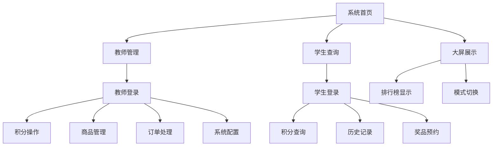

# 班级积分管理系统功能清单

## 1. 产品概述

班级积分管理系统是一个专为初中班级设计的现代化积分管理工具。系统通过教室大屏实时展示学生积分排行榜，教师可以便捷地进行积分操作和商品管理，学生能够查看个人积分并预约奖品兑换。系统采用MVP最简方案，专注于积分管理核心功能。

## 2. 核心功能

### 2.1 用户角色

| 角色 | 登录方式 | 核心权限 |
|------|----------|----------|
| 学生 | 学号直接登录（无需密码） | 查看个人积分、历史记录、预约奖品 |
| 教师 | 教师ID + 密码登录 | 积分操作、商品管理、订单处理、系统配置 |

### 2.2 功能模块

系统主要包含以下核心页面：

1. **系统首页**: 导航入口、系统介绍、快速访问
2. **大屏展示**: 实时积分排行榜、模式切换显示
3. **教师管理**: 积分操作、商品管理、订单处理、系统配置
4. **学生查询**: 个人积分查询、历史记录、奖品预约

### 2.3 页面详情

| 页面名称 | 模块名称 | 功能描述 |
|----------|----------|----------|
| 系统首页 | 导航卡片 | 提供三个主要功能入口的快速访问，包含功能介绍和特性说明 |
| 系统首页 | 系统信息 | 显示系统特性列表、快速开始指南、登录凭据说明 |
| 系统首页 | 动态配置 | 根据系统配置动态显示班级名称和版权信息 |
| 大屏展示 | 排行榜显示 | 实时显示总积分榜、日榜、周榜，支持自动刷新和数据更新 |
| 大屏展示 | 模式切换 | 支持平时模式（排行榜）和上课模式（积分操作界面）的切换 |
| 大屏展示 | 实时更新 | 通过SSE接收实时数据推送，自动更新排行榜和积分变化 |
| 教师管理 | 身份认证 | 教师登录验证，支持多个教师账号，JWT令牌管理 |
| 教师管理 | 积分操作 | 学生选择、加分减分操作、操作原因记录、实时余额更新 |
| 教师管理 | 商品管理 | 商品增删改查、库存管理、图片上传、状态控制 |
| 教师管理 | 订单处理 | 查看学生预约、确认兑换、取消订单、库存联动更新 |
| 教师管理 | 系统配置 | 模式切换、班级设置、系统参数配置、备份恢复 |
| 学生查询 | 身份认证 | 学号登录验证，无需密码，自动获取学生信息 |
| 学生查询 | 积分查询 | 显示当前积分余额、班级排名、积分变化趋势 |
| 学生查询 | 历史记录 | 查看个人积分变化历史、操作时间、操作原因 |
| 学生查询 | 奖品预约 | 浏览可用商品、检查积分余额、提交预约申请 |

## 3. 核心流程

### 3.1 教师操作流程

1. **登录流程**: 教师使用ID和密码登录 → 验证身份 → 获取JWT令牌 → 进入管理界面
2. **积分操作流程**: 选择学生 → 输入积分和原因 → 确认操作 → 更新学生余额 → 广播更新事件
3. **商品管理流程**: 添加/编辑商品信息 → 上传商品图片 → 设置价格和库存 → 保存商品数据
4. **订单处理流程**: 查看学生预约 → 确认兑换 → 扣除积分和库存 → 更新订单状态

### 3.2 学生操作流程

1. **登录流程**: 学生输入学号 → 验证学号存在 → 获取JWT令牌 → 进入个人中心
2. **积分查询流程**: 查看当前余额 → 查看排名信息 → 浏览历史记录
3. **奖品预约流程**: 浏览商品列表 → 选择心仪商品 → 检查积分余额 → 提交预约申请

### 3.3 系统自动流程

1. **实时更新流程**: 数据变化 → 触发SSE事件 → 广播给所有客户端 → 自动更新界面
2. **模式切换流程**: 教师登录状态变化 → 检测登录过期 → 自动切换系统模式 → 更新大屏显示
3. **数据同步流程**: 定期检查数据一致性 → 同步学生积分余额 → 更新排行榜缓存

## 4. 用户界面设计

### 4.1 设计风格

- **主色调**: 蓝色系 (#007bff) 为主，绿色 (#28a745) 为辅
- **按钮样式**: 圆角按钮，支持悬停效果和点击反馈
- **字体**: 系统默认字体，标题使用较大字号，正文使用适中字号
- **布局风格**: 卡片式布局，响应式设计，支持桌面和移动端
- **图标风格**: 使用SVG矢量图标，简洁现代的线条风格

### 4.2 页面设计概览

| 页面名称 | 模块名称 | UI元素 |
|----------|----------|--------|
| 系统首页 | 导航卡片 | 大尺寸卡片布局，SVG图标，渐变背景，悬停动画效果 |
| 系统首页 | 系统信息 | 双栏信息卡片，列表样式展示，代码高亮显示 |
| 大屏展示 | 排行榜 | 全屏表格布局，实时数据更新，排名徽章，积分变化动画 |
| 大屏展示 | 模式指示 | 顶部状态栏，模式标识，实时时间显示 |
| 教师管理 | 登录界面 | 居中模态框，表单验证，加载动画，错误提示 |
| 教师管理 | 操作界面 | 标签页布局，学生网格选择，操作表单，确认对话框 |
| 学生查询 | 个人中心 | 仪表板布局，积分卡片，图表展示，历史记录表格 |
| 学生查询 | 商品浏览 | 网格布局，商品卡片，价格标签，库存状态 |

### 4.3 响应式设计

系统采用移动优先的响应式设计策略：

- **桌面端**: 1200px以上，多栏布局，完整功能展示
- **平板端**: 768px-1199px，双栏布局，适配触摸操作
- **手机端**: 768px以下，单栏布局，简化操作界面
- **大屏显示**: 支持1920px以上分辨率，优化大屏展示效果

## 5. 技术特性

### 5.1 实时性

- **Server-Sent Events**: 基于SSE的实时数据推送
- **自动重连**: 客户端断线自动重连机制
- **事件广播**: 多客户端同步数据更新
- **即时反馈**: 操作结果立即反映到界面

### 5.2 数据一致性

- **事务处理**: 关键操作的原子性保证
- **数据验证**: 前后端双重数据验证
- **余额同步**: 自动同步学生积分余额
- **缓存管理**: 智能缓存更新和失效

### 5.3 性能优化

- **缓存机制**: 排行榜数据缓存，减少计算开销
- **懒加载**: 图片和组件按需加载
- **代码压缩**: 生产环境代码压缩和混淆
- **资源优化**: 静态资源压缩和缓存

### 5.4 安全性

- **JWT认证**: 基于令牌的无状态认证
- **权限控制**: 基于角色的访问控制
- **输入验证**: 严格的参数验证和过滤
- **错误处理**: 统一的错误处理和日志记录

## 6. 业务规则

### 6.1 积分管理规则

- **加分限制**: 单次加分不超过100分
- **减分规则**: 支持负积分，减分可超过当前余额
- **操作记录**: 所有积分操作必须记录操作者和原因
- **余额计算**: 基于历史记录实时计算积分余额

### 6.2 商品管理规则

- **价格设置**: 商品价格必须为正整数
- **库存管理**: 库存不足时自动显示缺货状态
- **状态控制**: 禁用商品不显示在学生端
- **图片要求**: 支持常见图片格式，限制文件大小

### 6.3 订单处理规则

- **积分检查**: 预约时检查学生积分是否充足
- **库存检查**: 预约时检查商品库存是否充足
- **积分冻结**: 预约成功后冻结相应积分
- **自动取消**: 长时间未确认的订单自动取消

### 6.4 系统模式规则

- **自动切换**: 教师登录过期自动切换到平时模式
- **权限限制**: 上课模式下学生无法进行预约操作
- **状态同步**: 模式切换实时同步到所有客户端

## 7. 数据统计

### 7.1 积分统计

- **总积分排行**: 按学生当前积分余额排序
- **日积分排行**: 按当日积分变化总和排序
- **周积分排行**: 按本周积分变化总和排序
- **积分趋势**: 学生积分变化趋势分析

### 7.2 商品统计

- **热门商品**: 按预约次数统计热门商品
- **库存统计**: 商品库存状态统计
- **兑换统计**: 商品兑换次数和积分消耗统计

### 7.3 系统统计

- **用户活跃度**: 学生登录和操作频率统计
- **操作统计**: 教师操作次数和类型统计
- **性能统计**: 系统响应时间和错误率统计

## 8. 系统配置

### 8.1 基础配置

- **班级信息**: 班级名称、年级信息
- **系统标题**: 自定义系统标题和副标题
- **版权信息**: 自定义版权和作者信息
- **联系方式**: 系统管理员联系方式

### 8.2 功能配置

- **积分规则**: 单次操作积分限制
- **排行榜设置**: 排行榜显示数量和更新频率
- **商品设置**: 商品图片大小限制
- **订单设置**: 订单自动取消时间

### 8.3 界面配置

- **主题颜色**: 自定义系统主题色彩
- **显示设置**: 大屏显示刷新间隔
- **语言设置**: 系统界面语言选择

## 9. 备份和恢复

### 9.1 数据备份

- **完整备份**: 包含所有数据文件的完整备份
- **增量备份**: 基于时间戳的增量数据备份
- **自动备份**: 定时自动创建备份文件
- **手动备份**: 支持管理员手动创建备份

### 9.2 数据恢复

- **一键恢复**: 从备份文件一键恢复系统数据
- **选择性恢复**: 选择特定数据类型进行恢复
- **备份验证**: 恢复前验证备份文件完整性
- **回滚机制**: 恢复失败时自动回滚到原状态

## 10. 系统监控

### 10.1 健康监控

- **系统状态**: 实时监控系统运行状态
- **性能指标**: 监控响应时间和资源使用
- **错误监控**: 自动收集和分析系统错误
- **告警机制**: 异常情况自动告警通知

### 10.2 日志管理

- **操作日志**: 记录所有用户操作行为
- **错误日志**: 记录系统错误和异常信息
- **访问日志**: 记录HTTP请求和响应信息
- **性能日志**: 记录系统性能指标数据

### 10.3 数据分析

- **使用统计**: 分析系统使用情况和用户行为
- **性能分析**: 分析系统性能瓶颈和优化点
- **错误分析**: 分析错误模式和改进方向
- **趋势分析**: 分析数据变化趋势和预测

## 11. 扩展功能

### 11.1 已实现功能

- ✅ 基础积分管理
- ✅ 实时排行榜
- ✅ 商品预约系统
- ✅ 多用户权限管理
- ✅ 数据备份恢复
- ✅ 系统监控日志
- ✅ 响应式界面设计
- ✅ 实时数据推送

### 11.2 潜在扩展

- 🔄 积分规则引擎
- 🔄 多班级支持
- 🔄 家长端查询
- 🔄 积分兑换记录
- 🔄 数据导出功能
- 🔄 移动端APP
- 🔄 微信小程序
- 🔄 数据可视化

## 12. 技术支持

### 12.1 部署支持

- **Docker部署**: 提供完整的Docker配置
- **传统部署**: 支持Node.js环境直接部署
- **云平台部署**: 支持各大云平台部署
- **部署文档**: 详细的部署指南和配置说明

### 12.2 维护支持

- **版本更新**: 定期发布功能更新和bug修复
- **技术支持**: 提供技术咨询和问题解答
- **文档维护**: 持续更新和完善技术文档
- **社区支持**: 建立用户社区和交流平台

---

*功能清单版本: v1.0.0*  
*最后更新: 2025年1月*  
*系统版本: 班级积分管理系统 v1.0.0*