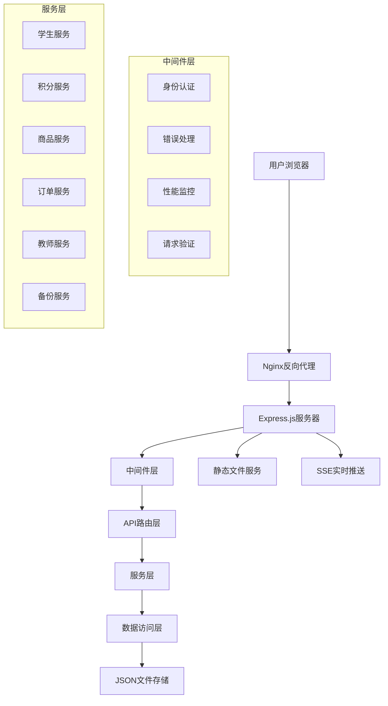

# 班级积分管理系统技术架构文档

## 1. 技术栈概览

### 1.1 后端技术栈
- **运行环境**: Node.js >= 14.0.0
- **Web框架**: Express.js 4.18.2
- **身份认证**: JSON Web Token (jsonwebtoken 9.0.2)
- **数据存储**: JSON文件系统
- **文件处理**: Multer 2.0.2 (文件上传)
- **压缩工具**: Archiver 7.0.1 (备份压缩)
- **解压工具**: Unzipper 0.12.3 (备份恢复)
- **文档处理**: Markdown-it 14.1.0
- **自动化测试**: Puppeteer 24.19.0

### 1.2 前端技术栈
- **基础技术**: HTML5 + CSS3 + 原生JavaScript
- **UI框架**: 无第三方框架，纯原生实现
- **实时通信**: Server-Sent Events (SSE)
- **响应式设计**: CSS Grid + Flexbox
- **模块化**: ES6 模块化

### 1.3 开发和测试工具
- **测试框架**: Jest 30.1.3
- **API测试**: Supertest 7.1.4
- **进程管理**: PM2 (ecosystem.config.js)
- **容器化**: Docker + Docker Compose

## 2. 系统架构设计

### 2.1 整体架构



### 2.2 分层架构

#### 表现层 (Presentation Layer)
- **大屏展示**: `/display` - 实时积分排行榜
- **教师管理**: `/teacher` - 积分操作、商品管理
- **学生查询**: `/student` - 个人积分、奖品预约
- **系统首页**: `/` - 导航和系统信息

#### 业务逻辑层 (Business Logic Layer)
- **积分管理**: 加分、减分、排行榜计算
- **用户认证**: JWT令牌验证、权限控制
- **商品管理**: 商品CRUD、库存管理
- **订单处理**: 预约、确认、取消流程

#### 数据访问层 (Data Access Layer)
- **文件操作**: 统一的JSON文件读写
- **数据验证**: 模型验证和数据完整性
- **缓存机制**: 排行榜缓存优化

## 3. 前端架构

### 3.1 目录结构

```
public/
├── index.html              # 系统首页
├── css/                    # 样式文件
│   ├── common.css         # 通用样式
│   ├── display.css        # 大屏展示样式
│   ├── teacher.css        # 教师管理样式
│   ├── student.css        # 学生查询样式
│   └── menu.css           # 菜单样式
├── js/                     # JavaScript文件
│   ├── common.js          # 通用工具函数
│   ├── display.js         # 大屏展示逻辑
│   ├── teacher.js         # 教师管理逻辑
│   ├── student.js         # 学生查询逻辑
│   ├── sse-client.js      # SSE客户端
│   └── menu.js            # 菜单控制
├── display/               # 大屏展示页面
├── teacher/               # 教师管理页面
└── student/               # 学生查询页面
```

### 3.2 核心前端模块

#### 通用工具模块 (common.js)
- **API请求封装**: 统一的HTTP请求处理
- **消息提示**: 用户反馈机制
- **本地存储**: localStorage封装
- **工具函数**: 日期格式化、防抖节流等

#### 实时通信模块 (sse-client.js)
- **SSE连接管理**: 自动重连机制
- **事件分发**: 不同类型事件的处理
- **状态同步**: 实时数据更新

#### 用户界面模块
- **响应式设计**: 支持桌面和移动端
- **模态框管理**: 登录、确认对话框
- **表单验证**: 客户端数据验证

## 4. 后端架构

### 4.1 目录结构

```
├── server.js               # 应用入口文件
├── api/                    # API路由层
│   ├── auth.js            # 身份认证接口
│   ├── points.js          # 积分管理接口
│   ├── students.js        # 学生管理接口
│   ├── products.js        # 商品管理接口
│   ├── orders.js          # 订单管理接口
│   ├── config.js          # 系统配置接口
│   ├── backup.js          # 备份管理接口
│   ├── logs.js            # 日志查询接口
│   └── sse.js             # 实时推送接口
├── services/               # 业务服务层
│   ├── studentService.js  # 学生业务逻辑
│   ├── pointsService.js   # 积分业务逻辑
│   ├── productService.js  # 商品业务逻辑
│   ├── orderService.js    # 订单业务逻辑
│   ├── teacherService.js  # 教师业务逻辑
│   ├── backupService.js   # 备份业务逻辑
│   ├── loggingService.js  # 日志业务逻辑
│   └── sseService.js      # 实时推送服务
├── middleware/             # 中间件层
│   ├── errorHandler.js    # 错误处理中间件
│   └── validation.js      # 数据验证中间件
├── models/                 # 数据模型层
│   └── dataModels.js      # 数据模型定义
└── utils/                  # 工具层
    ├── dataAccess.js      # 数据访问工具
    ├── dataInitializer.js # 数据初始化
    └── performanceMonitor.js # 性能监控
```

### 4.2 核心后端模块

#### 路由层 (API Layer)
- **RESTful设计**: 标准的HTTP方法和状态码
- **统一响应格式**: success、message、data结构
- **参数验证**: 请求参数的类型和范围验证
- **权限控制**: 基于JWT的身份认证和授权

#### 服务层 (Service Layer)
- **业务逻辑封装**: 核心业务规则实现
- **数据处理**: 复杂的数据计算和转换
- **缓存管理**: 排行榜等高频数据的缓存
- **事务处理**: 确保数据一致性

#### 中间件层 (Middleware Layer)
- **错误处理**: 统一的异常捕获和处理
- **性能监控**: 请求响应时间和系统资源监控
- **日志记录**: 操作日志和错误日志
- **安全防护**: 请求频率限制、参数过滤

## 5. 数据模型

### 5.1 核心数据实体

#### 学生信息 (StudentInfo)
```javascript
{
  id: string,           // 学号 (主键)
  name: string,         // 姓名
  class: string,        // 班级
  balance: number,      // 积分余额
  createdAt: string     // 创建时间
}
```

#### 积分记录 (PointRecord)
```javascript
{
  id: string,           // 记录ID (主键)
  studentId: string,    // 学号 (外键)
  points: number,       // 积分变化
  reason: string,       // 操作原因
  operatorId: string,   // 操作者ID
  timestamp: string,    // 操作时间
  type: string          // 操作类型: add/subtract/purchase/refund
}
```

#### 商品信息 (Product)
```javascript
{
  id: string,           // 商品ID (主键)
  name: string,         // 商品名称
  price: number,        // 积分价格
  stock: number,        // 库存数量
  description: string,  // 商品描述
  imageUrl: string,     // 商品图片
  isActive: boolean,    // 是否启用
  createdAt: string     // 创建时间
}
```

#### 订单信息 (Order)
```javascript
{
  id: string,           // 订单ID (主键)
  studentId: string,    // 学号 (外键)
  productId: string,    // 商品ID (外键)
  quantity: number,     // 数量
  totalPoints: number,  // 总积分
  status: string,       // 状态: pending/confirmed/cancelled
  createdAt: string,    // 创建时间
  confirmedAt: string   // 确认时间
}
```

#### 教师信息 (Teacher)
```javascript
{
  id: string,           // 教师ID (主键)
  name: string,         // 姓名
  password: string,     // 密码
  role: string,         // 角色
  department: string,   // 部门
  createdAt: string     // 创建时间
}
```

### 5.2 数据存储结构

```
data/
├── students.json       # 学生信息
├── points.json         # 积分记录
├── products.json       # 商品信息
├── orders.json         # 订单信息
├── teachers.json       # 教师信息
├── config.json         # 系统配置
└── temp-uploads/       # 临时上传文件
```

## 6. API接口设计

### 6.1 身份认证接口

```
POST /api/auth/student-login    # 学生登录
POST /api/auth/teacher-login    # 教师登录
GET  /api/auth/verify           # 验证令牌
POST /api/auth/logout           # 登出
```

### 6.2 积分管理接口

```
GET  /api/points/rankings                    # 获取排行榜
GET  /api/points/rankings/all               # 获取所有类型排行榜
GET  /api/points/rankings/:type             # 获取特定类型排行榜
POST /api/points/add                        # 加分操作
POST /api/points/subtract                   # 减分操作
GET  /api/points/student/:studentId         # 获取学生积分记录
POST /api/points/sync-balances              # 同步积分余额
```

### 6.3 学生管理接口

```
GET  /api/students                          # 获取学生列表
GET  /api/students/:studentId               # 获取学生信息
POST /api/students                          # 创建学生
PUT  /api/students/:studentId               # 更新学生信息
DEL  /api/students/:studentId               # 删除学生
GET  /api/students/search                   # 搜索学生
```

### 6.4 商品管理接口

```
GET  /api/products                          # 获取商品列表
GET  /api/products/:productId               # 获取商品详情
POST /api/products                          # 创建商品
PUT  /api/products/:productId               # 更新商品
DEL  /api/products/:productId               # 删除商品
POST /api/products/:productId/upload-image  # 上传商品图片
```

### 6.5 订单管理接口

```
GET  /api/orders                            # 获取订单列表
GET  /api/orders/:orderId                   # 获取订单详情
POST /api/orders                            # 创建订单
PUT  /api/orders/:orderId/confirm           # 确认订单
PUT  /api/orders/:orderId/cancel            # 取消订单
GET  /api/orders/student/:studentId         # 获取学生订单
```

### 6.6 系统配置接口

```
GET  /api/config/mode                       # 获取系统模式
POST /api/config/mode                       # 设置系统模式
GET  /api/config/settings                   # 获取系统设置
POST /api/config/settings                   # 更新系统设置
```

### 6.7 实时推送接口

```
GET  /api/sse/connect                       # SSE连接
```

## 7. 核心功能模块

### 7.1 积分管理模块

#### 功能特性
- **积分操作**: 支持加分、减分操作
- **实时更新**: 积分变化实时推送到大屏
- **历史记录**: 完整的积分变化记录
- **余额计算**: 自动计算和同步学生积分余额

#### 业务规则
- 单次加分不超过100分
- 支持负积分（减分可超过余额）
- 所有操作记录操作者和时间
- 积分变化实时广播给所有连接的客户端

### 7.2 排行榜模块

#### 功能特性
- **多维度排行**: 总积分、日榜、周榜
- **实时更新**: 积分变化后自动更新排行榜
- **缓存优化**: 1分钟缓存机制提升性能
- **分页支持**: 支持限制返回数量

#### 计算逻辑
- **总积分榜**: 按学生当前积分余额排序
- **日榜**: 按当日积分变化总和排序
- **周榜**: 按本周积分变化总和排序

### 7.3 商品管理模块

#### 功能特性
- **商品CRUD**: 完整的商品管理功能
- **库存管理**: 自动库存扣减和恢复
- **图片上传**: 支持商品图片上传
- **状态控制**: 商品启用/禁用状态

#### 业务规则
- 商品价格必须为正数
- 库存不足时显示缺货状态
- 删除商品前检查是否有未完成订单

### 7.4 订单管理模块

#### 功能特性
- **预约机制**: 学生预约商品，教师确认兑换
- **积分冻结**: 预约时冻结积分，确认时扣除
- **订单状态**: pending(待确认) / confirmed(已确认) / cancelled(已取消)
- **库存联动**: 确认订单时自动扣减库存

#### 业务流程
1. 学生选择商品并预约
2. 系统检查积分余额和商品库存
3. 创建待确认订单，冻结相应积分
4. 教师确认兑换，扣除积分和库存
5. 或学生/教师取消订单，解冻积分

### 7.5 用户认证模块

#### 功能特性
- **双重认证**: 学生免密登录，教师密码登录
- **JWT令牌**: 基于JWT的无状态认证
- **权限控制**: 基于角色的访问控制
- **自动过期**: 学生24小时，教师8小时

#### 安全机制
- 教师密码加密存储
- JWT令牌包含用户类型和权限信息
- API接口根据用户类型进行权限验证

### 7.6 实时通信模块

#### 功能特性
- **SSE推送**: 基于Server-Sent Events的实时通信
- **事件类型**: 积分更新、排行榜更新、系统模式切换
- **自动重连**: 客户端断线自动重连机制
- **广播机制**: 向所有连接的客户端广播事件

#### 事件类型
- `pointsUpdate`: 积分变化事件
- `rankingsUpdate`: 排行榜更新事件
- `modeChange`: 系统模式切换事件
- `orderUpdate`: 订单状态变化事件

### 7.7 系统配置模块

#### 功能特性
- **模式切换**: 上课模式/平时模式切换
- **系统设置**: 班级名称、版权信息等
- **自动切换**: 教师登录过期自动切换到平时模式

### 7.8 备份恢复模块

#### 功能特性
- **完整备份**: 所有数据文件的压缩备份
- **增量备份**: 基于时间戳的增量备份
- **一键恢复**: 从备份文件恢复系统数据
- **备份验证**: 备份文件完整性验证

## 8. 部署和运维

### 8.1 部署方式

#### Docker部署
```yaml
# docker-compose.yml
version: '3.8'
services:
  classroom-points:
    build: .
    ports:
      - "3010:3010"
    volumes:
      - ./data:/app/data
      - ./logs:/app/logs
    environment:
      - NODE_ENV=production
      - PORT=3010
```

#### PM2部署
```javascript
// ecosystem.config.js
module.exports = {
  apps: [{
    name: 'classroom-points',
    script: 'server.js',
    instances: 1,
    exec_mode: 'fork',
    env: {
      NODE_ENV: 'production',
      PORT: 3010
    }
  }]
};
```

### 8.2 系统监控

#### 健康检查
- **接口**: `GET /api/health`
- **监控指标**: 系统状态、响应时间、错误率
- **自动检查**: 定时健康检查脚本

#### 性能监控
- **请求监控**: API响应时间统计
- **内存监控**: 内存使用情况跟踪
- **错误监控**: 错误日志收集和分析

### 8.3 日志管理

#### 日志类型
- **访问日志**: HTTP请求记录
- **操作日志**: 业务操作记录
- **错误日志**: 异常和错误记录
- **性能日志**: 性能指标记录

#### 日志轮转
- 按日期分割日志文件
- 自动清理过期日志
- 日志压缩存储

### 8.4 备份策略

#### 自动备份
- **每日备份**: 凌晨自动创建完整备份
- **增量备份**: 每小时创建增量备份
- **备份保留**: 保留30天内的备份文件

#### 备份验证
- 备份文件完整性检查
- 定期恢复测试
- 备份文件异地存储

## 9. 性能优化策略

### 9.1 前端优化

#### 资源优化
- **CSS压缩**: 生产环境CSS文件压缩
- **JavaScript压缩**: 代码混淆和压缩
- **图片优化**: 图片格式优化和压缩
- **缓存策略**: 静态资源浏览器缓存

#### 加载优化
- **懒加载**: 图片和组件按需加载
- **预加载**: 关键资源预加载
- **代码分割**: 按页面分割JavaScript代码

### 9.2 后端优化

#### 数据库优化
- **缓存机制**: 排行榜数据缓存
- **索引优化**: 数据查询索引优化
- **连接池**: 数据库连接池管理

#### API优化
- **响应压缩**: Gzip压缩API响应
- **请求合并**: 批量API请求处理
- **异步处理**: 非关键操作异步执行

### 9.3 系统优化

#### 内存优化
- **对象池**: 重用对象减少GC压力
- **内存监控**: 实时内存使用监控
- **内存泄漏**: 定期检查和修复内存泄漏

#### 并发优化
- **请求限流**: 防止恶意请求攻击
- **负载均衡**: 多实例负载分担
- **异步处理**: 高并发异步处理机制

### 9.4 监控和调优

#### 性能指标
- **响应时间**: API平均响应时间
- **吞吐量**: 每秒处理请求数
- **错误率**: 请求错误率统计
- **资源使用**: CPU和内存使用率

#### 调优策略
- **性能基准**: 建立性能基准测试
- **瓶颈分析**: 识别和解决性能瓶颈
- **容量规划**: 根据使用情况规划容量
- **持续优化**: 定期性能评估和优化

## 10. 安全策略

### 10.1 身份认证安全
- **JWT安全**: 使用强密钥和适当过期时间
- **密码安全**: 教师密码加密存储
- **会话管理**: 安全的会话管理机制

### 10.2 数据安全
- **输入验证**: 严格的输入参数验证
- **SQL注入防护**: 参数化查询防止注入
- **XSS防护**: 输出内容转义防止XSS
- **CSRF防护**: CSRF令牌验证

### 10.3 系统安全
- **访问控制**: 基于角色的访问控制
- **文件安全**: 上传文件类型和大小限制
- **日志安全**: 敏感信息脱敏记录
- **备份安全**: 备份文件加密存储

---

*文档版本: v1.0.0*  
*最后更新: 2025年1月*  
*维护团队: 班级积分管理系统开发团队*